# AttendIQ COA — Smart Attendance, Engagement, and Learning Rewards Platform

> **Project context:** AttendIQ COA is a privacy-first classroom engagement platform designed for **Computer Organization and Architecture (COA)** classes. The system encourages genuine class attendance by combining lightweight presence verification, in-class participation checkpoints, academic reward unlocking, and future AI-powered learning support.

---

## 1. Executive Summary

AttendIQ COA is not just an attendance application. It is a **classroom engagement system** that uses attendance as the entry point to unlock learning value. The platform helps institutions and faculty verify whether students are present in the correct classroom, check whether students actively participated in the class, and reward consistent participation with access to academic resources.

The system is designed for:

- **150–200 registered students** in the first deployment.
- **100–250 peak concurrent logins** during class start/check-in windows.
- **Student-phone-first usage**, without requiring dedicated hardware.
- **Free/open-source-first development**, using low-cost or free-tier tools.
- **Privacy-first verification**, avoiding continuous tracking, biometrics, audio recording, or camera surveillance.

The long-term vision includes a Phase 2 Edge AI layer using **OCR + T5 fine-tuned with LoRA** on COA subject matter resources to provide personalized learning support from handwritten notes, class submissions, and assignments.

---

## 2. Problem Statement

Computer Organization and Architecture is conceptually difficult because students must understand abstract hardware-level ideas such as CPU organization, instruction execution cycles, addressing modes, arithmetic circuits, control unit design, pipelining, cache memory, memory hierarchy, DMA, interrupts, and process state transitions.

Typical problems include:

- Students skip classes because COA feels theoretical and difficult.
- Students may physically attend but remain disengaged.
- Faculty manually track attendance, which is time-consuming and vulnerable to proxy attendance.
- Institutions receive attendance numbers but not meaningful engagement insights.
- Learning resources are often distributed without connection to actual class participation.
- Faculty cannot easily identify which topics the class struggled with during a session.

### Design Challenge

```text
How might we increase genuine student attendance and active engagement in COA classes
while preserving privacy and operating within a free/open-source-first development budget?
```

---

## 3. Proposed Solution

AttendIQ COA uses four connected layers:

1. **Presence Verification**  
   Verifies that the student checked in during the valid class session using a rotating QR code and optional classroom proximity signals such as campus WiFi.

2. **Participation Verification**  
   Confirms class engagement through short micro-quizzes, polls, or concept checkpoints during the lecture.

3. **Reward and Resource Unlocking**  
   Students unlock academic resources based on attendance and participation thresholds.

4. **Faculty Analytics**  
   Faculty can view attendance, participation, topic difficulty patterns, and resource usage.

---

## 4. Core Functionalities

### 4.1 Student Functionalities

- Register/login using institutional credentials.
- View enrolled COA course and upcoming class sessions.
- Scan rotating classroom QR code for attendance.
- Complete in-class concept checks.
- View attendance percentage and participation score.
- Track reward tier progress.
- Access unlocked resources such as notes, PYQs, lab solutions, revision notes, quizzes, and practice tests.
- View weak-topic recommendations.
- Submit handwritten notes or answer images in Phase 2 AI mode.

### 4.2 Faculty Functionalities

- Create and start a COA class session.
- Generate rotating QR code for check-in.
- Monitor live attendance count.
- Push micro-quizzes during lecture.
- View quiz responses and topic-level understanding.
- Upload and map resources to reward tiers.
- Export attendance and participation reports.
- Review risk flags such as suspicious repeated device/session patterns.

### 4.3 Admin Functionalities

- Create academic departments, courses, classrooms, and batches.
- Assign faculty to courses.
- Enroll students into course sections.
- Configure attendance rules and resource unlock policies.
- Maintain audit logs.
- Manage privacy and data retention policies.

### 4.4 Phase 2 AI Functionalities

- Upload handwritten notes or assignment images.
- Run OCR to extract text.
- Use fine-tuned T5 model to identify concept coverage.
- Recommend resources based on missing COA concepts.
- Generate class-level weak-topic heatmaps.
- Support faculty with insight summaries, not automatic grading decisions.

---

## 5. System Design Overview

### 5.1 High-Level System Design Diagram

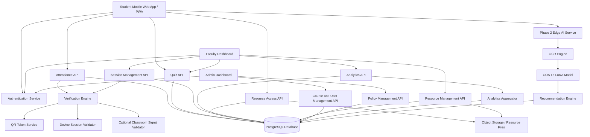

---

## 6. Architecture Components

### 6.1 Client Layer

| Component | Description |
|---|---|
| Student Mobile App / PWA | Phone-first interface for check-in, quizzes, attendance history, rewards, and resources. |
| Faculty Dashboard | Web dashboard for session creation, QR display, live attendance, quizzes, and analytics. |
| Admin Dashboard | Web dashboard for managing users, courses, classrooms, policies, and audit logs. |

### 6.2 Backend Layer

| Component | Description |
|---|---|
| Authentication Service | Handles login, JWT/session generation, role verification, and access control. |
| Session Management API | Creates, starts, pauses, and closes class sessions. |
| Attendance API | Receives QR scan events and creates attendance records after validation. |
| Verification Engine | Validates QR token, class session status, timestamp, device hash, and optional classroom proximity signal. |
| Quiz API | Handles concept checks, questions, answers, and participation scoring. |
| Reward Engine | Calculates reward tiers based on attendance and participation rules. |
| Resource Access API | Controls resource visibility based on reward tier and enrolled course. |
| Analytics API | Provides attendance, quiz, resource, and weak-topic insights. |
| Audit Logger | Tracks sensitive actions such as manual overrides, policy changes, and resource modifications. |

### 6.3 Data Layer

| Component | Description |
|---|---|
| PostgreSQL Database | Stores users, courses, sessions, attendance, quizzes, resources, policies, and audit logs. |
| Object Storage | Stores PDFs, lecture notes, practice files, quiz attachments, and AI-uploaded files. |
| Cache Layer | Optional cache for short-lived QR tokens and session state. |

### 6.4 Phase 2 AI Layer

| Component | Description |
|---|---|
| OCR Engine | Extracts text from handwritten notes or images. |
| COA T5 LoRA Model | Fine-tuned text-to-text model for COA concept extraction and feedback generation. |
| Recommendation Engine | Maps missing concepts to curated resources. |
| Edge Runtime | Optional local/edge deployment for privacy and cost control. |

---

## 7. Suggested Technology Stack

| Layer | Recommended Option | Reason |
|---|---|---|
| Frontend | React + Next.js / PWA | Good for phone-first web experience and free hosting support. |
| Backend | FastAPI | Lightweight, simple, high-performance API development. |
| Database | PostgreSQL | Relational data model fits attendance, users, sessions, quizzes, and policies. |
| Auth | Supabase Auth / Firebase Auth / custom JWT | Fast MVP authentication setup. |
| Storage | Supabase Storage / Firebase Storage / S3-compatible storage | Resource file management. |
| Hosting | Vercel + Render/Fly.io/free-tier alternatives | Suitable for prototype and pilot. |
| AI OCR | Tesseract / PaddleOCR | Open-source OCR options. |
| AI Model | T5-small/base + LoRA | Low-cost domain adaptation for COA content. |
| Diagrams | Mermaid | Markdown-native system and UML diagrams. |

---

## 8. Database Schema Design

> The following schemas are normalized for clarity. They can be implemented in PostgreSQL. Field types can be adjusted based on the selected backend framework and ORM.

### 8.1 `users`

Stores all platform users: students, faculty, and admins.

| Column | Type | Constraints | Description |
|---|---|---|---|
| id | UUID | PK | Unique user ID. |
| institutional_id | VARCHAR(50) | UNIQUE, NOT NULL | College roll number, employee ID, or institutional identifier. |
| full_name | VARCHAR(150) | NOT NULL | User display name. |
| email | VARCHAR(150) | UNIQUE, NOT NULL | Institutional email. |
| role | VARCHAR(20) | NOT NULL | `student`, `faculty`, or `admin`. |
| phone_hash | VARCHAR(255) | NULL | Optional hashed phone/device binding reference. |
| is_active | BOOLEAN | DEFAULT TRUE | Whether account is active. |
| created_at | TIMESTAMP | DEFAULT NOW() | Record creation time. |
| updated_at | TIMESTAMP | DEFAULT NOW() | Last update time. |

### 8.2 `departments`

| Column | Type | Constraints | Description |
|---|---|---|---|
| id | UUID | PK | Department ID. |
| name | VARCHAR(150) | NOT NULL | Department name. |
| code | VARCHAR(20) | UNIQUE | Department code. |
| created_at | TIMESTAMP | DEFAULT NOW() | Creation time. |

### 8.3 `courses`

| Column | Type | Constraints | Description |
|---|---|---|---|
| id | UUID | PK | Course ID. |
| department_id | UUID | FK -> departments.id | Owning department. |
| course_code | VARCHAR(30) | NOT NULL | Example: `COA301`. |
| course_name | VARCHAR(150) | NOT NULL | Example: Computer Organization and Architecture. |
| syllabus_summary | TEXT | NULL | Short syllabus description. |
| created_at | TIMESTAMP | DEFAULT NOW() | Creation time. |

### 8.4 `course_sections`

Represents a batch/section of students for a course.

| Column | Type | Constraints | Description |
|---|---|---|---|
| id | UUID | PK | Section ID. |
| course_id | UUID | FK -> courses.id | Related course. |
| faculty_id | UUID | FK -> users.id | Faculty assigned to section. |
| section_name | VARCHAR(100) | NOT NULL | Example: `COA-A`, `Batch 2026`. |
| academic_term | VARCHAR(50) | NOT NULL | Example: `Semester 3`. |
| created_at | TIMESTAMP | DEFAULT NOW() | Creation time. |

### 8.5 `enrollments`

Maps students to course sections.

| Column | Type | Constraints | Description |
|---|---|---|---|
| id | UUID | PK | Enrollment ID. |
| student_id | UUID | FK -> users.id | Enrolled student. |
| section_id | UUID | FK -> course_sections.id | Course section. |
| enrollment_status | VARCHAR(30) | DEFAULT `active` | `active`, `dropped`, `completed`. |
| created_at | TIMESTAMP | DEFAULT NOW() | Creation time. |

### 8.6 `classrooms`

| Column | Type | Constraints | Description |
|---|---|---|---|
| id | UUID | PK | Classroom ID. |
| room_code | VARCHAR(50) | UNIQUE, NOT NULL | Example: `LAB-COA-02`. |
| room_name | VARCHAR(150) | NOT NULL | Human-readable room name. |
| building_name | VARCHAR(150) | NULL | Building name. |
| wifi_ssid_hash | VARCHAR(255) | NULL | Optional hashed classroom WiFi SSID reference. |
| beacon_id_hash | VARCHAR(255) | NULL | Optional BLE beacon hash. |
| latitude | DECIMAL(10,7) | NULL | Optional approximate location. |
| longitude | DECIMAL(10,7) | NULL | Optional approximate location. |
| created_at | TIMESTAMP | DEFAULT NOW() | Creation time. |

### 8.7 `class_sessions`

Represents one lecture/class event.

| Column | Type | Constraints | Description |
|---|---|---|---|
| id | UUID | PK | Class session ID. |
| section_id | UUID | FK -> course_sections.id | Related section. |
| classroom_id | UUID | FK -> classrooms.id | Classroom location. |
| topic_title | VARCHAR(200) | NOT NULL | Example: `Pipeline Hazards`. |
| session_date | DATE | NOT NULL | Class date. |
| start_time | TIMESTAMP | NOT NULL | Scheduled/actual start time. |
| end_time | TIMESTAMP | NULL | End time. |
| status | VARCHAR(30) | DEFAULT `scheduled` | `scheduled`, `active`, `paused`, `closed`, `cancelled`. |
| created_by | UUID | FK -> users.id | Faculty/admin who created it. |
| created_at | TIMESTAMP | DEFAULT NOW() | Creation time. |

### 8.8 `qr_tokens`

Stores rotating QR token metadata. Actual token should be signed and short-lived.

| Column | Type | Constraints | Description |
|---|---|---|---|
| id | UUID | PK | QR token ID. |
| session_id | UUID | FK -> class_sessions.id | Class session. |
| token_hash | VARCHAR(255) | NOT NULL | Hash of generated QR token. |
| valid_from | TIMESTAMP | NOT NULL | Token start validity. |
| valid_until | TIMESTAMP | NOT NULL | Token expiry. |
| is_revoked | BOOLEAN | DEFAULT FALSE | Whether token is invalidated. |
| created_at | TIMESTAMP | DEFAULT NOW() | Creation time. |

### 8.9 `attendance_records`

| Column | Type | Constraints | Description |
|---|---|---|---|
| id | UUID | PK | Attendance record ID. |
| session_id | UUID | FK -> class_sessions.id | Class session. |
| student_id | UUID | FK -> users.id | Student. |
| enrollment_id | UUID | FK -> enrollments.id | Enrollment reference. |
| check_in_time | TIMESTAMP | NOT NULL | Time of check-in. |
| verification_status | VARCHAR(30) | NOT NULL | `verified`, `pending_review`, `rejected`, `manual_override`. |
| qr_verified | BOOLEAN | DEFAULT FALSE | Whether QR token was valid. |
| device_verified | BOOLEAN | DEFAULT FALSE | Whether device/session matched policy. |
| proximity_verified | BOOLEAN | DEFAULT FALSE | Whether optional location/WiFi signal passed. |
| risk_score | INTEGER | DEFAULT 0 | Computed risk score from 0–100. |
| remarks | TEXT | NULL | Optional faculty/admin remarks. |
| created_at | TIMESTAMP | DEFAULT NOW() | Creation time. |

### 8.10 `device_sessions`

| Column | Type | Constraints | Description |
|---|---|---|---|
| id | UUID | PK | Device session ID. |
| user_id | UUID | FK -> users.id | User. |
| device_hash | VARCHAR(255) | NOT NULL | Hashed device fingerprint. |
| login_ip_hash | VARCHAR(255) | NULL | Hashed IP for risk detection. |
| user_agent_hash | VARCHAR(255) | NULL | Hashed browser/device info. |
| session_started_at | TIMESTAMP | DEFAULT NOW() | Login/session start time. |
| session_expires_at | TIMESTAMP | NOT NULL | Session expiry. |
| is_active | BOOLEAN | DEFAULT TRUE | Active session flag. |

### 8.11 `quiz_questions`

| Column | Type | Constraints | Description |
|---|---|---|---|
| id | UUID | PK | Question ID. |
| course_id | UUID | FK -> courses.id | Related COA course. |
| topic | VARCHAR(150) | NOT NULL | Example: `Cache Mapping`. |
| question_text | TEXT | NOT NULL | Question content. |
| option_a | TEXT | NULL | MCQ option A. |
| option_b | TEXT | NULL | MCQ option B. |
| option_c | TEXT | NULL | MCQ option C. |
| option_d | TEXT | NULL | MCQ option D. |
| correct_option | VARCHAR(10) | NULL | Correct MCQ option. |
| difficulty | VARCHAR(20) | DEFAULT `medium` | `easy`, `medium`, `hard`. |
| created_by | UUID | FK -> users.id | Faculty/admin creator. |
| created_at | TIMESTAMP | DEFAULT NOW() | Creation time. |

### 8.12 `session_quizzes`

Maps questions to a live class session.

| Column | Type | Constraints | Description |
|---|---|---|---|
| id | UUID | PK | Session quiz ID. |
| session_id | UUID | FK -> class_sessions.id | Related class session. |
| question_id | UUID | FK -> quiz_questions.id | Question. |
| launched_at | TIMESTAMP | NOT NULL | Time launched. |
| closes_at | TIMESTAMP | NOT NULL | Time closes. |
| status | VARCHAR(30) | DEFAULT `active` | `active`, `closed`, `cancelled`. |

### 8.13 `quiz_responses`

| Column | Type | Constraints | Description |
|---|---|---|---|
| id | UUID | PK | Response ID. |
| session_quiz_id | UUID | FK -> session_quizzes.id | Session quiz. |
| student_id | UUID | FK -> users.id | Student respondent. |
| selected_option | VARCHAR(10) | NULL | Selected answer. |
| free_text_answer | TEXT | NULL | Optional free-text answer. |
| is_correct | BOOLEAN | NULL | Correctness for auto-gradable questions. |
| response_time | TIMESTAMP | DEFAULT NOW() | Submission time. |

### 8.14 `resources`

| Column | Type | Constraints | Description |
|---|---|---|---|
| id | UUID | PK | Resource ID. |
| course_id | UUID | FK -> courses.id | Related course. |
| uploaded_by | UUID | FK -> users.id | Faculty/admin uploader. |
| title | VARCHAR(200) | NOT NULL | Resource title. |
| resource_type | VARCHAR(50) | NOT NULL | `notes`, `pyq`, `lab_solution`, `practice_test`, `flashcard`, `video`, `ai_pack`. |
| topic | VARCHAR(150) | NULL | Related COA topic. |
| file_url | TEXT | NOT NULL | Storage URL/path. |
| required_tier | VARCHAR(30) | DEFAULT `bronze` | `bronze`, `silver`, `gold`, `platinum`. |
| is_active | BOOLEAN | DEFAULT TRUE | Whether resource is visible. |
| created_at | TIMESTAMP | DEFAULT NOW() | Creation time. |

### 8.15 `reward_policies`

| Column | Type | Constraints | Description |
|---|---|---|---|
| id | UUID | PK | Policy ID. |
| course_id | UUID | FK -> courses.id | Course. |
| tier_name | VARCHAR(30) | NOT NULL | `bronze`, `silver`, `gold`, `platinum`. |
| min_attendance_percentage | DECIMAL(5,2) | NOT NULL | Minimum attendance requirement. |
| min_participation_score | DECIMAL(5,2) | DEFAULT 0 | Minimum participation score. |
| created_at | TIMESTAMP | DEFAULT NOW() | Creation time. |

### 8.16 `student_reward_status`

| Column | Type | Constraints | Description |
|---|---|---|---|
| id | UUID | PK | Reward status ID. |
| student_id | UUID | FK -> users.id | Student. |
| course_id | UUID | FK -> courses.id | Course. |
| attendance_percentage | DECIMAL(5,2) | DEFAULT 0 | Current attendance percentage. |
| participation_score | DECIMAL(8,2) | DEFAULT 0 | Current participation score. |
| current_tier | VARCHAR(30) | DEFAULT `none` | Current reward tier. |
| updated_at | TIMESTAMP | DEFAULT NOW() | Last calculated time. |

### 8.17 `resource_access_logs`

| Column | Type | Constraints | Description |
|---|---|---|---|
| id | UUID | PK | Access log ID. |
| student_id | UUID | FK -> users.id | Student. |
| resource_id | UUID | FK -> resources.id | Resource accessed. |
| access_time | TIMESTAMP | DEFAULT NOW() | Access time. |
| access_allowed | BOOLEAN | NOT NULL | Whether access was granted. |
| denial_reason | TEXT | NULL | Reason if denied. |

### 8.18 `ai_submissions` Phase 2

| Column | Type | Constraints | Description |
|---|---|---|---|
| id | UUID | PK | AI submission ID. |
| student_id | UUID | FK -> users.id | Student. |
| course_id | UUID | FK -> courses.id | Course. |
| session_id | UUID | FK -> class_sessions.id, NULL | Optional related session. |
| image_file_url | TEXT | NOT NULL | Uploaded image path. |
| extracted_text | TEXT | NULL | OCR output. |
| model_feedback | JSONB | NULL | T5/LoRA feedback output. |
| processing_status | VARCHAR(30) | DEFAULT `queued` | `queued`, `processing`, `completed`, `failed`. |
| created_at | TIMESTAMP | DEFAULT NOW() | Creation time. |

### 8.19 `audit_logs`

| Column | Type | Constraints | Description |
|---|---|---|---|
| id | UUID | PK | Audit log ID. |
| actor_user_id | UUID | FK -> users.id | User who performed action. |
| action | VARCHAR(100) | NOT NULL | Example: `SESSION_STARTED`, `ATTENDANCE_OVERRIDE`. |
| entity_type | VARCHAR(100) | NOT NULL | Affected entity type. |
| entity_id | UUID | NULL | Affected entity ID. |
| metadata | JSONB | NULL | Additional details. |
| created_at | TIMESTAMP | DEFAULT NOW() | Time of action. |

---

## 9. Entity Relationship Diagram

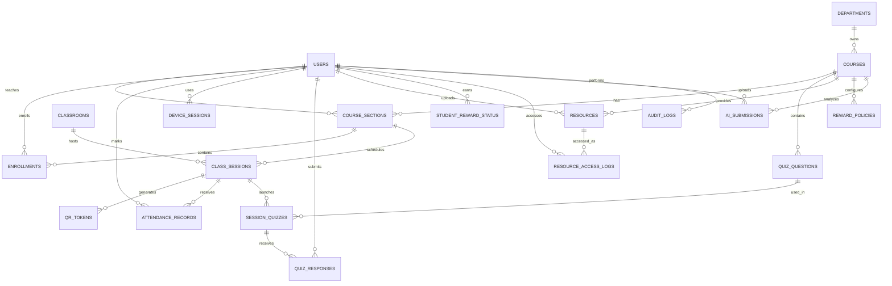

---

## 10. API Endpoint Design

> Base URL example: `/api/v1`

### 10.1 Authentication APIs

#### POST `/auth/register`

Registers a new user. In a real deployment, registration should be restricted or linked to institutional identity verification.

**Request Body**

```json
{
  "institutionalId": "COA2026001",
  "fullName": "Student Name",
  "email": "student@example.edu",
  "password": "StrongPassword@123",
  "role": "student"
}
```

**Response Body**

```json
{
  "success": true,
  "message": "User registered successfully",
  "data": {
    "userId": "uuid",
    "email": "student@example.edu",
    "role": "student"
  }
}
```

#### POST `/auth/login`

Authenticates a user and returns access token.

**Request Body**

```json
{
  "email": "student@example.edu",
  "password": "StrongPassword@123",
  "deviceHash": "sha256-device-hash"
}
```

**Response Body**

```json
{
  "success": true,
  "message": "Login successful",
  "data": {
    "accessToken": "jwt-access-token",
    "refreshToken": "jwt-refresh-token",
    "expiresIn": 3600,
    "user": {
      "id": "uuid",
      "fullName": "Student Name",
      "role": "student"
    }
  }
}
```

#### POST `/auth/logout`

Invalidates a user session.

**Request Body**

```json
{
  "deviceHash": "sha256-device-hash"
}
```

**Response Body**

```json
{
  "success": true,
  "message": "Logged out successfully"
}
```

---

### 10.2 Course and Enrollment APIs

#### GET `/courses`

Returns courses visible to the logged-in user.

**Response Body**

```json
{
  "success": true,
  "data": [
    {
      "courseId": "uuid",
      "courseCode": "COA301",
      "courseName": "Computer Organization and Architecture",
      "sectionId": "uuid",
      "sectionName": "Batch A"
    }
  ]
}
```

#### POST `/admin/courses`

Creates a course. Admin only.

**Request Body**

```json
{
  "departmentId": "uuid",
  "courseCode": "COA301",
  "courseName": "Computer Organization and Architecture",
  "syllabusSummary": "CPU, ISA, data representation, arithmetic, control unit, memory, I/O, pipelining, cache."
}
```

**Response Body**

```json
{
  "success": true,
  "message": "Course created successfully",
  "data": {
    "courseId": "uuid"
  }
}
```

#### POST `/admin/enrollments`

Enrolls a student into a course section. Admin only.

**Request Body**

```json
{
  "studentId": "uuid",
  "sectionId": "uuid"
}
```

**Response Body**

```json
{
  "success": true,
  "message": "Student enrolled successfully",
  "data": {
    "enrollmentId": "uuid"
  }
}
```

---

### 10.3 Class Session APIs

#### POST `/faculty/sessions`

Creates a class session. Faculty only.

**Request Body**

```json
{
  "sectionId": "uuid",
  "classroomId": "uuid",
  "topicTitle": "Pipeline Hazards",
  "sessionDate": "2026-07-16",
  "startTime": "2026-07-16T10:00:00+05:30",
  "endTime": "2026-07-16T11:00:00+05:30"
}
```

**Response Body**

```json
{
  "success": true,
  "message": "Class session created",
  "data": {
    "sessionId": "uuid",
    "status": "scheduled"
  }
}
```

#### POST `/faculty/sessions/{sessionId}/start`

Starts a session and activates QR generation.

**Request Body**

```json
{
  "qrRotationSeconds": 30,
  "allowProximitySignal": true
}
```

**Response Body**

```json
{
  "success": true,
  "message": "Session started",
  "data": {
    "sessionId": "uuid",
    "status": "active",
    "qrTokenExpiresAt": "2026-07-16T10:00:30+05:30"
  }
}
```

#### POST `/faculty/sessions/{sessionId}/close`

Closes a class session.

**Request Body**

```json
{
  "closingRemarks": "Lecture completed. Covered pipeline hazards and forwarding."
}
```

**Response Body**

```json
{
  "success": true,
  "message": "Session closed successfully",
  "data": {
    "sessionId": "uuid",
    "status": "closed"
  }
}
```

#### GET `/faculty/sessions/{sessionId}/live`

Returns live class session status.

**Response Body**

```json
{
  "success": true,
  "data": {
    "sessionId": "uuid",
    "topicTitle": "Pipeline Hazards",
    "status": "active",
    "checkedInCount": 143,
    "quizSubmittedCount": 118,
    "riskFlagCount": 12
  }
}
```

---

### 10.4 QR and Attendance APIs

#### GET `/faculty/sessions/{sessionId}/qr`

Returns current QR token payload or QR image metadata. Faculty only.

**Response Body**

```json
{
  "success": true,
  "data": {
    "sessionId": "uuid",
    "qrPayload": "signed-short-lived-token",
    "validUntil": "2026-07-16T10:00:30+05:30",
    "rotationSeconds": 30
  }
}
```

#### POST `/student/attendance/check-in`

Marks student attendance after QR and policy verification.

**Request Body**

```json
{
  "sessionId": "uuid",
  "qrPayload": "signed-short-lived-token",
  "deviceHash": "sha256-device-hash",
  "proximitySignal": {
    "wifiSsidHash": "optional-wifi-hash",
    "beaconHash": "optional-beacon-hash"
  }
}
```

**Response Body — Verified**

```json
{
  "success": true,
  "message": "Attendance marked successfully",
  "data": {
    "attendanceId": "uuid",
    "verificationStatus": "verified",
    "checkInTime": "2026-07-16T10:03:15+05:30",
    "riskScore": 5
  }
}
```

**Response Body — Pending Review**

```json
{
  "success": true,
  "message": "Attendance submitted for review",
  "data": {
    "attendanceId": "uuid",
    "verificationStatus": "pending_review",
    "riskScore": 65,
    "reason": "QR valid but proximity signal was not available"
  }
}
```

**Response Body — Rejected**

```json
{
  "success": false,
  "message": "Attendance check-in rejected",
  "error": {
    "code": "QR_EXPIRED",
    "details": "The QR token is no longer valid"
  }
}
```

#### GET `/student/attendance/summary?courseId={courseId}`

Returns student attendance summary.

**Response Body**

```json
{
  "success": true,
  "data": {
    "courseId": "uuid",
    "totalSessions": 20,
    "attendedSessions": 16,
    "attendancePercentage": 80.0,
    "currentTier": "silver"
  }
}
```

#### POST `/faculty/attendance/{attendanceId}/override`

Allows faculty/admin to manually override attendance status with reason.

**Request Body**

```json
{
  "verificationStatus": "manual_override",
  "remarks": "Student had QR scan issue but was physically present in class."
}
```

**Response Body**

```json
{
  "success": true,
  "message": "Attendance status updated",
  "data": {
    "attendanceId": "uuid",
    "verificationStatus": "manual_override"
  }
}
```

---

### 10.5 Quiz and Participation APIs

#### POST `/faculty/sessions/{sessionId}/quizzes`

Launches a micro-quiz during class.

**Request Body**

```json
{
  "questionId": "uuid",
  "durationSeconds": 90
}
```

**Response Body**

```json
{
  "success": true,
  "message": "Quiz launched",
  "data": {
    "sessionQuizId": "uuid",
    "closesAt": "2026-07-16T10:25:30+05:30"
  }
}
```

#### GET `/student/sessions/{sessionId}/active-quiz`

Returns active quiz for student.

**Response Body**

```json
{
  "success": true,
  "data": {
    "sessionQuizId": "uuid",
    "questionText": "Which pipeline hazard occurs when an instruction depends on the result of a previous instruction?",
    "options": [
      { "key": "A", "value": "Structural hazard" },
      { "key": "B", "value": "Data hazard" },
      { "key": "C", "value": "Control hazard" },
      { "key": "D", "value": "Memory hazard" }
    ],
    "closesAt": "2026-07-16T10:25:30+05:30"
  }
}
```

#### POST `/student/quizzes/{sessionQuizId}/responses`

Submits student response.

**Request Body**

```json
{
  "selectedOption": "B"
}
```

**Response Body**

```json
{
  "success": true,
  "message": "Response submitted",
  "data": {
    "responseId": "uuid",
    "isCorrect": true,
    "participationPointsAwarded": 5
  }
}
```

#### GET `/faculty/sessions/{sessionId}/quiz-analytics`

Returns quiz analytics for a session.

**Response Body**

```json
{
  "success": true,
  "data": {
    "sessionId": "uuid",
    "totalQuestions": 2,
    "totalResponses": 118,
    "topicPerformance": [
      {
        "topic": "Pipeline Hazards",
        "correctPercentage": 68.5,
        "difficultySignal": "medium"
      }
    ]
  }
}
```

---

### 10.6 Resource and Reward APIs

#### POST `/faculty/resources`

Uploads or registers a course resource. Faculty only.

**Request Body**

```json
{
  "courseId": "uuid",
  "title": "Cache Mapping Revision Notes",
  "resourceType": "notes",
  "topic": "Cache Memory",
  "fileUrl": "storage://resources/cache-mapping.pdf",
  "requiredTier": "gold"
}
```

**Response Body**

```json
{
  "success": true,
  "message": "Resource created successfully",
  "data": {
    "resourceId": "uuid",
    "requiredTier": "gold"
  }
}
```

#### GET `/student/resources?courseId={courseId}`

Returns resources visible to the student according to current tier.

**Response Body**

```json
{
  "success": true,
  "data": {
    "currentTier": "silver",
    "resources": [
      {
        "resourceId": "uuid",
        "title": "Instruction Cycle Notes",
        "resourceType": "notes",
        "topic": "Instruction Execution Cycle",
        "accessAllowed": true
      },
      {
        "resourceId": "uuid",
        "title": "Cache Mapping Practice Test",
        "resourceType": "practice_test",
        "topic": "Cache Memory",
        "accessAllowed": false,
        "requiredTier": "gold"
      }
    ]
  }
}
```

#### GET `/student/rewards?courseId={courseId}`

Returns reward status.

**Response Body**

```json
{
  "success": true,
  "data": {
    "courseId": "uuid",
    "attendancePercentage": 80.0,
    "participationScore": 72.5,
    "currentTier": "silver",
    "nextTier": "gold",
    "requiredForNextTier": {
      "attendancePercentage": 90.0,
      "participationScore": 75.0
    }
  }
}
```

---

### 10.7 Analytics APIs

#### GET `/faculty/analytics/course/{courseId}`

Returns course-level analytics.

**Response Body**

```json
{
  "success": true,
  "data": {
    "courseId": "uuid",
    "averageAttendancePercentage": 76.4,
    "averageParticipationScore": 64.2,
    "weakTopics": [
      {
        "topic": "Cache Mapping",
        "correctPercentage": 52.0
      },
      {
        "topic": "Booth Multiplication",
        "correctPercentage": 58.5
      }
    ],
    "resourceUsage": [
      {
        "resourceType": "notes",
        "accessCount": 320
      }
    ]
  }
}
```

#### GET `/admin/audit-logs?entityType={entityType}`

Returns audit logs. Admin only.

**Response Body**

```json
{
  "success": true,
  "data": [
    {
      "auditLogId": "uuid",
      "actorUserId": "uuid",
      "action": "ATTENDANCE_OVERRIDE",
      "entityType": "attendance_records",
      "entityId": "uuid",
      "createdAt": "2026-07-16T10:45:00+05:30"
    }
  ]
}
```

---

### 10.8 Phase 2 AI APIs

#### POST `/student/ai/submissions`

Submits handwritten notes or answer images for AI-assisted feedback.

**Request Body**

```json
{
  "courseId": "uuid",
  "sessionId": "uuid",
  "imageFileUrl": "storage://ai-submissions/student-answer-001.png"
}
```

**Response Body**

```json
{
  "success": true,
  "message": "AI submission received",
  "data": {
    "submissionId": "uuid",
    "processingStatus": "queued"
  }
}
```

#### GET `/student/ai/submissions/{submissionId}`

Returns AI processing result.

**Response Body**

```json
{
  "success": true,
  "data": {
    "submissionId": "uuid",
    "processingStatus": "completed",
    "extractedText": "Pipeline hazards include structural hazards, data hazards and control hazards...",
    "modelFeedback": {
      "conceptCoverageScore": 82,
      "detectedConcepts": [
        "Data hazard",
        "Control hazard",
        "Forwarding"
      ],
      "missingConcepts": [
        "Pipeline stall",
        "Branch prediction"
      ],
      "recommendedResources": [
        {
          "resourceId": "uuid",
          "title": "Pipeline Hazards Revision Notes"
        }
      ]
    }
  }
}
```

---

## 11. Security and Privacy Design

### 11.1 Security Goals

- Verify classroom attendance without continuous surveillance.
- Prevent casual proxy attendance.
- Protect student identity and academic records.
- Ensure only authorized faculty/admin users can modify sessions and resources.
- Maintain auditability for sensitive operations.

### 11.2 Privacy Principles

The system should not collect:

- Continuous GPS location.
- Camera recordings.
- Audio recordings.
- Face recognition data.
- Biometric data.
- Background activity outside class sessions.

The system may collect:

- User identity linked to institutional login.
- Attendance event timestamp.
- Session ID and classroom ID.
- Short-lived QR validation result.
- Hashed device/session signal.
- Optional proximity signal only during check-in.
- Quiz participation data.
- Resource access logs.

### 11.3 Recommended Security Controls

| Area | Control |
|---|---|
| Authentication | JWT/session-based auth with refresh token rotation. |
| Authorization | Role-based access control for student/faculty/admin operations. |
| Transport Security | HTTPS/TLS for all API calls. |
| Data Protection | Encrypt sensitive fields and avoid storing raw device fingerprints. |
| QR Security | Use signed, short-lived, single-session QR tokens. |
| Device Risk | Store only hashed device identifiers. |
| Auditability | Log overrides, policy changes, resource modifications, and admin actions. |
| Data Retention | Delete or archive raw logs based on institutional retention policy. |
| AI Safety | AI feedback should support learning, not make final grading decisions. |

---

## 12. UML Diagrams

### 12.1 Use Case Diagram

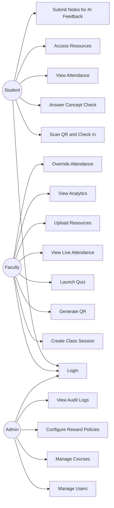

### 12.2 Class Diagram

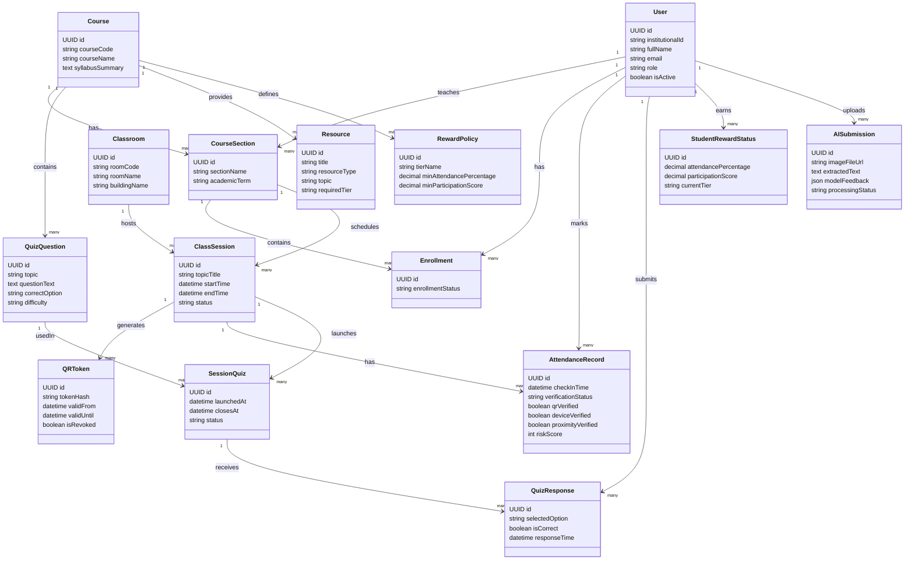

### 12.3 Sequence Diagram — Student Check-In

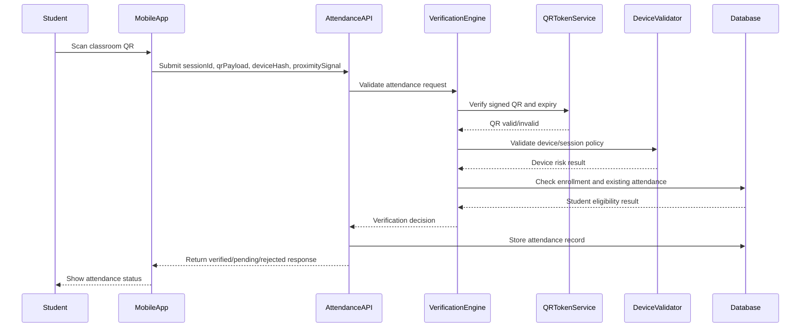

### 12.4 Sequence Diagram — Faculty Launches Quiz

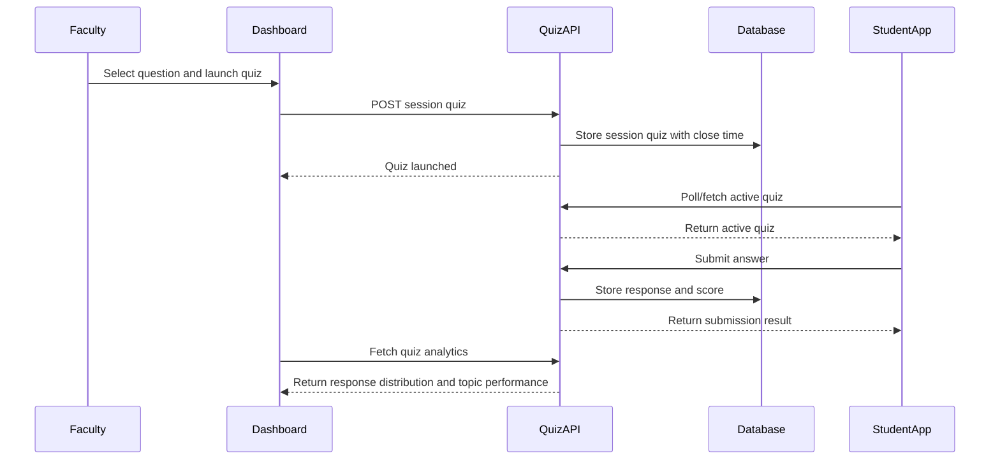

### 12.5 Sequence Diagram — Phase 2 AI Feedback

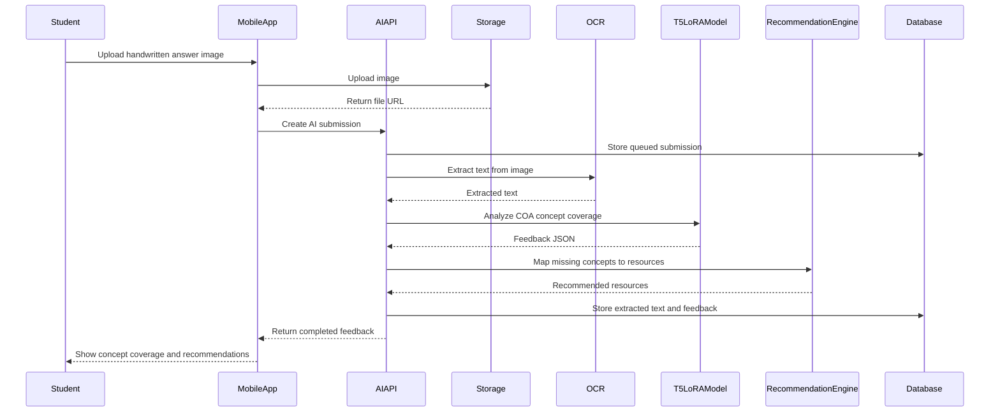

---

## 13. Non-Functional Requirements

| Category | Requirement |
|---|---|
| Performance | Support 100–250 concurrent logins/check-ins during peak class start windows. |
| Availability | MVP should be available during scheduled class hours. Production deployment should later add monitoring and backups. |
| Scalability | Architecture should allow horizontal backend scaling and database indexing. |
| Privacy | Avoid continuous tracking and biometric collection. |
| Security | Use authenticated APIs, role-based access, HTTPS, audit logs, and short-lived QR tokens. |
| Usability | Student check-in should complete in a few interactions. Faculty session start should be simple enough to use during live class. |
| Maintainability | Backend should use modular services: auth, sessions, attendance, quizzes, resources, analytics, AI. |
| Extensibility | Phase 2 AI layer should be added without redesigning the MVP data model. |
| Cost | MVP should use free/open-source-first tools wherever practical. |

---

## 14. Suggested Folder Structure

```text
attendiq-coa/
├── frontend/
│   ├── student-app/
│   ├── faculty-dashboard/
│   └── admin-dashboard/
├── backend/
│   ├── app/
│   │   ├── auth/
│   │   ├── users/
│   │   ├── courses/
│   │   ├── sessions/
│   │   ├── attendance/
│   │   ├── quizzes/
│   │   ├── resources/
│   │   ├── rewards/
│   │   ├── analytics/
│   │   ├── audit/
│   │   └── ai/
│   ├── tests/
│   └── migrations/
├── database/
│   ├── schema.sql
│   └── seed.sql
├── docs/
│   ├── architecture.md
│   ├── api-spec.md
│   ├── privacy-policy.md
│   └── srs.md
└── README.md
```

---

## 15. MVP Development Plan

### Sprint 1 — Foundation

- Authentication and role-based access.
- Course, section, classroom, and enrollment setup.
- Faculty session creation.
- Basic database schema and migrations.

### Sprint 2 — Attendance

- QR generation and validation.
- Student check-in flow.
- Attendance record storage.
- Faculty live attendance dashboard.

### Sprint 3 — Engagement

- Quiz question bank.
- Live concept check launch.
- Student answer submission.
- Participation score calculation.

### Sprint 4 — Rewards and Analytics

- Reward policy setup.
- Resource upload and access control.
- Attendance summary and reward tier progress.
- Faculty analytics and CSV exports.

### Phase 2 — AI Learning Assistant

- OCR pipeline.
- T5 + LoRA concept feedback model.
- AI submission workflow.
- Personalized recommendations.
- Weak-topic insight dashboard.

---

# 16. Software Requirements Specification SRS

## 16.1 Introduction

### 16.1.1 Purpose

The purpose of this Software Requirements Specification is to define the functional, non-functional, security, privacy, and system requirements for AttendIQ COA, a smart attendance and learning engagement platform for Computer Organization and Architecture classes.

### 16.1.2 Scope

The system will support student attendance verification, classroom participation checks, faculty dashboards, resource unlocking, reward tier management, analytics, and optional AI-assisted personalized learning in a later phase.

### 16.1.3 Intended Users

- Students enrolled in COA.
- Faculty teaching COA.
- Academic administrators.
- System maintainers.

### 16.1.4 Product Perspective

AttendIQ COA is a web/mobile-first platform consisting of a frontend application, backend APIs, relational database, object storage, and optional AI processing components. It can operate as a standalone academic tool or integrate later with institutional identity and learning management systems.

---

## 16.2 Overall Description

### 16.2.1 Product Functions

The system shall:

- Authenticate users by role.
- Allow faculty to create and manage class sessions.
- Generate short-lived QR tokens for attendance verification.
- Allow students to check in for active class sessions.
- Validate attendance using QR, time window, device/session data, and optional proximity signal.
- Allow faculty to launch micro-quizzes.
- Allow students to submit quiz responses.
- Calculate attendance percentage and participation scores.
- Unlock academic resources based on reward tiers.
- Provide faculty analytics.
- Maintain audit logs.
- Support future AI-based notebook/answer evaluation.

### 16.2.2 User Classes

| User Class | Description |
|---|---|
| Student | Attends class, checks in, answers quizzes, views progress, accesses resources. |
| Faculty | Creates sessions, generates QR, launches quizzes, uploads resources, reviews analytics. |
| Admin | Manages users, courses, sections, classrooms, policies, and audits. |
| System Maintainer | Deploys, monitors, and maintains the platform. |

### 16.2.3 Operating Environment

- Student and faculty users access through modern mobile or desktop browsers.
- Backend APIs run on a web server environment.
- PostgreSQL-compatible database is used for persistence.
- Object storage is used for resource files.
- Optional AI components may run on cloud, local server, or edge device.

### 16.2.4 Design Constraints

- MVP should avoid paid infrastructure where possible.
- MVP should not require special hardware.
- System should work on common smartphones.
- System should avoid continuous location tracking or biometric verification.
- QR tokens must be short-lived.
- Faculty workflows must remain simple enough for live classroom usage.

---

## 16.3 Functional Requirements

### FR-1 User Authentication

The system shall allow users to log in securely using institutional credentials or platform-managed credentials.

### FR-2 Role-Based Access

The system shall restrict actions according to user roles: student, faculty, and admin.

### FR-3 Course Management

The system shall allow admins to create departments, courses, sections, classrooms, and enrollments.

### FR-4 Class Session Management

The system shall allow faculty to create, start, pause, and close class sessions.

### FR-5 QR Token Generation

The system shall generate short-lived QR tokens linked to an active class session.

### FR-6 Attendance Check-In

The system shall allow students to submit attendance check-ins using QR payload, session ID, device hash, and optional proximity signal.

### FR-7 Attendance Verification

The system shall verify attendance based on active session status, QR validity, timestamp validity, enrollment status, duplicate attendance rules, and device/session policy.

### FR-8 Attendance Review

The system shall allow faculty/admin users to review and manually override pending or disputed attendance records with remarks.

### FR-9 Quiz Management

The system shall allow faculty to create and launch micro-quizzes during active sessions.

### FR-10 Quiz Submission

The system shall allow students to submit quiz responses before quiz close time.

### FR-11 Participation Scoring

The system shall calculate student participation score based on submitted concept checks and configured scoring rules.

### FR-12 Resource Management

The system shall allow faculty to upload resources and assign required reward tiers.

### FR-13 Resource Access Control

The system shall allow or deny student access to resources based on current reward tier and course enrollment.

### FR-14 Reward Tier Calculation

The system shall calculate student reward tier based on attendance percentage and participation score.

### FR-15 Analytics Dashboard

The system shall provide faculty analytics including attendance count, quiz participation, weak topics, and resource usage summaries.

### FR-16 Audit Logging

The system shall log sensitive actions including attendance overrides, policy changes, resource changes, and admin operations.

### FR-17 AI Submission Phase 2

The system shall allow students to upload handwritten notes or answer images for AI processing in Phase 2.

### FR-18 AI Feedback Phase 2

The system shall extract text using OCR and produce concept feedback using a COA-specialized model in Phase 2.

---

## 16.4 Non-Functional Requirements

### NFR-1 Performance

The system should support 100–250 concurrent check-in/login requests during peak class windows.

### NFR-2 Usability

The student check-in flow should be simple and phone-friendly. The faculty session workflow should be usable during live teaching without major interruption.

### NFR-3 Reliability

The system should avoid duplicate attendance records and should handle expired QR tokens gracefully.

### NFR-4 Security

The system shall use secure authentication, authorization, HTTPS, short-lived QR tokens, and audit logs.

### NFR-5 Privacy

The system shall avoid continuous monitoring, biometric capture, camera recording, and audio recording.

### NFR-6 Maintainability

The backend should be modular and service-oriented so that attendance, quiz, resource, reward, and AI modules can evolve independently.

### NFR-7 Portability

The frontend should work across common mobile and desktop browsers.

### NFR-8 Cost Efficiency

The MVP should prioritize free/open-source tools and free-tier hosting options where practical.

---

## 16.5 External Interface Requirements

### 16.5.1 User Interface

- Student mobile interface for check-in, quiz, rewards, and resources.
- Faculty dashboard for live session management.
- Admin dashboard for institutional configuration.

### 16.5.2 Hardware Interface

- Student smartphone camera for QR scanning.
- Optional WiFi or BLE signal for proximity validation.
- Optional Phase 2 edge device/server for AI inference.

### 16.5.3 Software Interface

- PostgreSQL database.
- Object storage service.
- Authentication provider.
- OCR engine in Phase 2.
- T5 LoRA model runtime in Phase 2.

### 16.5.4 Communication Interface

- HTTP/HTTPS REST APIs.
- JSON request and response format.
- Optional WebSocket/SSE for live dashboard updates.

---

## 16.6 Data Requirements

The system shall store:

- User profiles and roles.
- Course, section, classroom, and enrollment data.
- Class sessions and QR token metadata.
- Attendance records and verification status.
- Quiz questions and responses.
- Reward policies and student reward status.
- Resource metadata and access logs.
- Audit logs.
- AI submissions and generated feedback in Phase 2.

---

## 16.7 Security Requirements

- Passwords must be hashed if platform-managed authentication is used.
- JWT/session tokens must expire.
- QR tokens must be signed and short-lived.
- Device identifiers must be hashed before storage.
- Access to faculty/admin APIs must require role verification.
- Manual overrides must require remarks and audit logging.
- AI uploads must be accessible only to authorized users.

---

## 16.8 Privacy Requirements

- The system must not continuously track students.
- The system must not collect biometric data.
- The system must not record camera/video/audio for attendance.
- Optional proximity validation must be limited to check-in time.
- Students should be informed what data is collected and why.
- Data retention policy should be configurable by institution.

---

## 16.9 Acceptance Criteria

The MVP is acceptable when:

- A faculty user can create and start a COA class session.
- A rotating QR token can be generated for the active session.
- A student can scan QR and receive verified/pending/rejected attendance status.
- Duplicate attendance is prevented.
- Faculty can view live attendance count.
- Faculty can launch a micro-quiz.
- Students can submit quiz responses.
- Reward tier is calculated from attendance and participation.
- Students can access only eligible resources.
- Faculty can export or view attendance and participation summaries.
- Admin/faculty sensitive actions are audit logged.

---

## 16.10 Future Enhancements

- Offline-first check-in sync for poor network conditions.
- WebSocket live attendance updates.
- Anonymous leaderboard mode.
- LMS integration.
- Institutional SSO integration.
- Advanced proxy detection using risk scoring.
- Edge AI notebook evaluation.
- Faculty-facing weak-topic recommendation dashboard.
- Personalized revision planner for each student.

---

## 17. Final Design Note

AttendIQ COA should be positioned as a **student engagement and academic value platform**, not as a surveillance-based attendance tool. The most important product principle is:

```text
Attendance should unlock better learning, not merely enforce presence.
```

The MVP should prove that students are more likely to attend and participate when class presence gives them meaningful access to resources, feedback, and academic progress.


# 18. Production Repository Structure

```text
attendiq-coa/
├── frontend/
├── backend/
├── ai-services/
├── database/
├── storage/
├── infrastructure/
├── docs/
├── scripts/
├── .github/
├── README.md
├── docker-compose.yml
└── .env.example
```

## Frontend Structure

```text
frontend/
├── student-app/
├── faculty-dashboard/
└── admin-dashboard/
```

## Backend Micro-Module Structure

```text
backend/app/
├── auth/
├── users/
├── courses/
├── enrollments/
├── classrooms/
├── sessions/
├── attendance/
├── verification/
├── quizzes/
├── rewards/
├── resources/
├── analytics/
├── audits/
├── notifications/
├── reports/
└── ai/
```

# 19. Threat Model

## Major Threats

### T1 QR Sharing Attack
Student shares screenshot of active QR.

Mitigations:
- Rotating QR every 30 seconds
- Short-lived signed token
- Single attendance per session
- Device risk scoring

### T2 Session Hijacking

Mitigations:
- JWT expiration
- Refresh token rotation
- Device session tracking

### T3 Device Spoofing

Mitigations:
- Hashed device fingerprint
- Behavioral anomaly detection

### T4 Resource Abuse

Mitigations:
- Tier-based resource controls
- Signed download links
- Audit logging

### T5 AI Abuse

Mitigations:
- Rate limits
- File validation
- Malware scanning

# 20. Capacity Planning

## Initial Scale

- Students: 150–200
- Peak Concurrent Users: 100–250
- Daily Attendance Events: ~200
- Quiz Responses per Session: 200+

## Expected Load

```text
Peak Login Burst:
250 concurrent users

Attendance Burst:
250 check-ins within 2 minutes

Estimated Peak:
20–50 requests/sec
```

## Database Growth

```text
Attendance Records
~200/day
~60,000/year

Quiz Responses
~150,000/year

Audit Logs
~25,000/year
```

# 21. Deployment Architecture

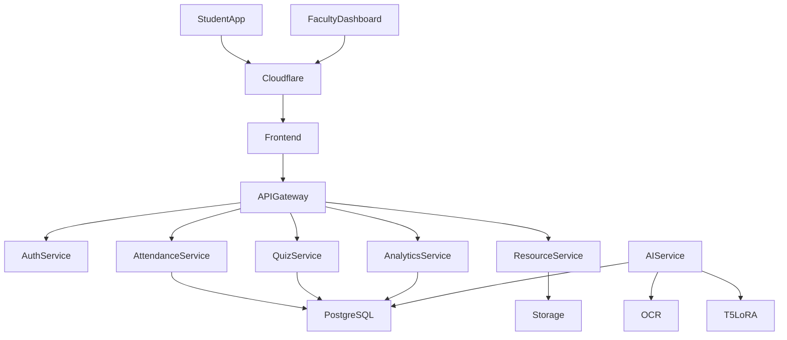

## Prototype Deployment

Frontend:
- Vercel

Backend:
- FastAPI
- Render/Fly.io

Database:
- PostgreSQL
- Supabase

Storage:
- Supabase Storage

Monitoring:
- Grafana
- Prometheus

# 22. Documents Required For Architecture Review

```text
HLD.md
LLD.md
ERD.md
API_SPEC.md
UML.md
SECURITY.md
DEPLOYMENT.md
AI_ARCHITECTURE.md
COST_ESTIMATION.md
SRS.md
```

# 23. Senior Architect Review Checklist

- Functional requirements covered
- Non-functional requirements covered
- Privacy-first design validated
- Threat model documented
- Capacity planning documented
- API contracts defined
- Database schema defined
- UML diagrams included
- ERD included
- SRS included
- MVP roadmap defined
- Phase-2 AI architecture defined
- Production deployment architecture defined
- Repository structure defined

# 24. Executive Summary

AttendIQ COA transforms attendance from a compliance activity into an engagement-driven learning platform. The architecture combines privacy-preserving classroom verification, participation analytics, academic reward systems, and a future-ready Edge AI learning assistant. The solution is intentionally designed for low-cost deployment while remaining scalable, secure, and extensible for university-wide adoption.


---

# 25. Complete High-Level Design HLD Document

## 25.1 HLD Purpose

This High-Level Design defines the end-to-end architecture for AttendIQ COA. The goal of the HLD is to explain the major system components, data movement, user interactions, security boundaries, scalability assumptions, deployment strategy, and integration points.

The HLD is intended for:

- Architecture reviewers.
- Faculty mentors.
- Engineering team members.
- Backend developers.
- Frontend developers.
- AI/ML developers.
- Security reviewers.
- Deployment engineers.

## 25.2 HLD Scope

The HLD covers:

- Smart attendance verification.
- Student participation verification.
- Reward-tier based academic resource unlocking.
- Faculty analytics.
- Admin configuration.
- Privacy and security controls.
- Phase 2 AI pipeline using OCR + T5 + LoRA.
- Deployment model for prototype and production.

The HLD does not define exact UI pixel-level design. UI/UX designs are handled separately in the pitch deck and frontend implementation.

## 25.3 Business Context

The current classroom attendance process is often compliance-driven. AttendIQ COA reframes attendance as a learning-value journey. Students do not only mark attendance; students earn academic progress through classroom participation. Faculty do not only record presence; faculty receive live learning signals.

## 25.4 HLD Goals

| Goal | Description |
|---|---|
| Attendance Reliability | Reduce casual proxy attendance using rotating QR and optional classroom signals. |
| Engagement Measurement | Capture participation through micro-quizzes and concept checks. |
| Student Motivation | Unlock resources based on attendance and participation. |
| Faculty Visibility | Provide topic-level analytics and attendance dashboards. |
| Privacy Protection | Avoid continuous tracking, biometrics, audio, or video capture. |
| Low-Cost Deployment | Support free/open-source-first implementation. |
| Future AI Readiness | Support AI-assisted learning feedback in Phase 2. |

## 25.5 HLD Non-Goals

- The system is not a biometric attendance system.
- The system is not a continuous student tracking platform.
- The system is not a replacement for faculty grading.
- The AI layer is not intended to make final academic decisions.
- The MVP does not require IoT hardware, BLE beacon deployment, or paid cloud services.

## 25.6 Actors

| Actor | Description |
|---|---|
| Student | Uses phone to check in, answer quizzes, view rewards, access resources. |
| Faculty | Creates class sessions, displays QR, launches quizzes, views analytics. |
| Admin | Manages users, courses, classrooms, policies, and audit logs. |
| AI Service | Processes OCR and COA concept feedback in Phase 2. |
| Storage Service | Stores resources and uploaded learning artifacts. |
| Notification Service | Optional future service for reminders and updates. |

## 25.7 System Context Diagram

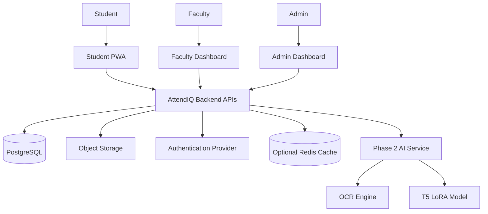

## 25.8 Container-Level Architecture

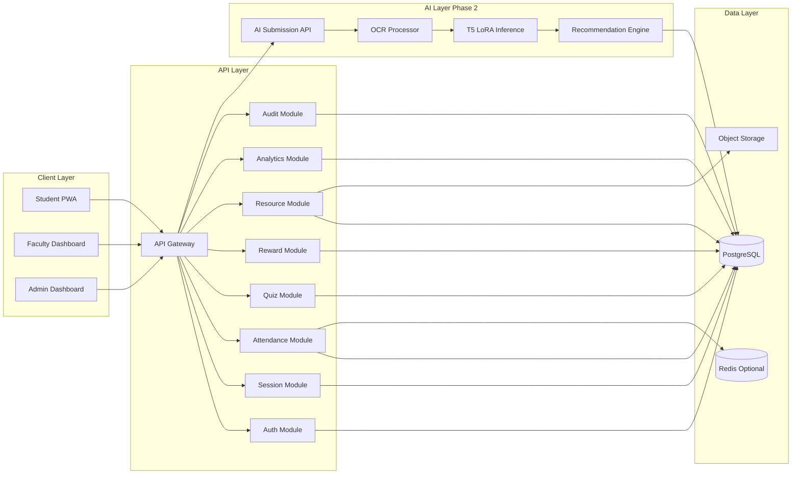

## 25.9 Component Responsibilities

### Student PWA

Responsible for:

- Authentication flow.
- QR scan interface.
- Attendance status display.
- Quiz answering.
- Reward progress visualization.
- Resource browsing.
- AI submission upload in Phase 2.

### Faculty Dashboard

Responsible for:

- Creating sessions.
- Starting and closing sessions.
- Displaying QR token.
- Launching micro-quizzes.
- Viewing live attendance.
- Viewing analytics.
- Managing course resources.

### Admin Dashboard

Responsible for:

- User, department, course, section, and classroom setup.
- Enrollment management.
- Reward policy configuration.
- Audit review.
- System-level configuration.

### Backend API Gateway

Responsible for:

- Routing API requests.
- Validating JWT/session.
- Enforcing rate limits.
- Returning consistent JSON responses.
- Acting as the entry point to domain modules.

### Verification Engine

Responsible for:

- QR token validation.
- Session status validation.
- Time-window check.
- Enrollment validation.
- Duplicate check-in prevention.
- Device/session risk check.
- Optional proximity signal validation.

### Reward Engine

Responsible for:

- Calculating student attendance percentage.
- Calculating participation score.
- Mapping scores to reward tiers.
- Enforcing tier-based resource access.

### Analytics Aggregator

Responsible for:

- Session-level attendance analytics.
- Course-level attendance summaries.
- Quiz response distributions.
- Weak-topic identification.
- Resource access usage summaries.

## 25.10 HLD Data Flow: Attendance

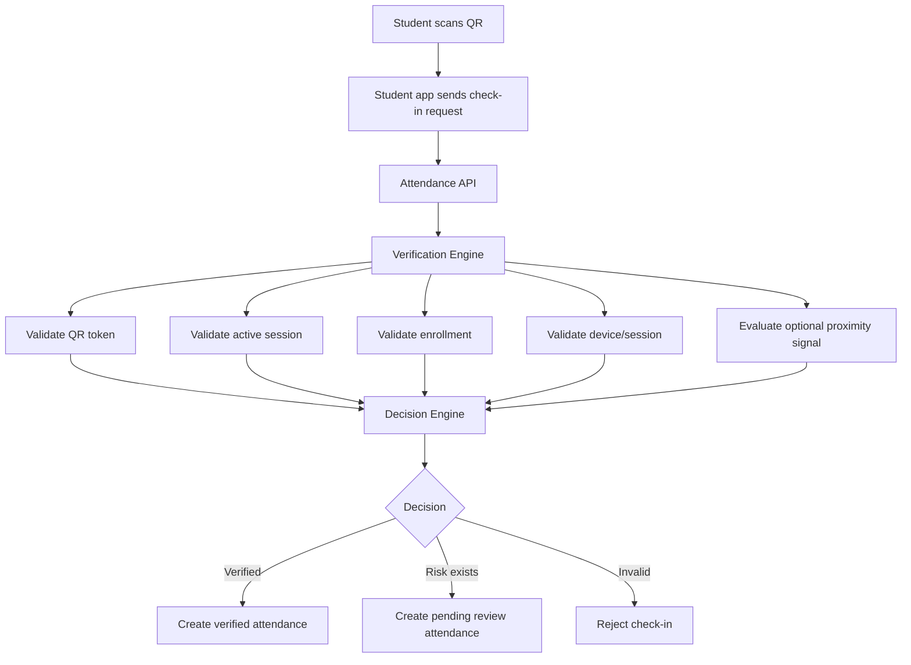

## 25.11 HLD Data Flow: Quiz Participation

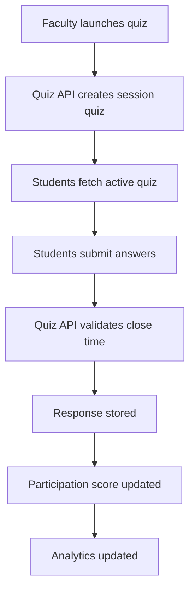

## 25.12 HLD Data Flow: Resource Unlocking

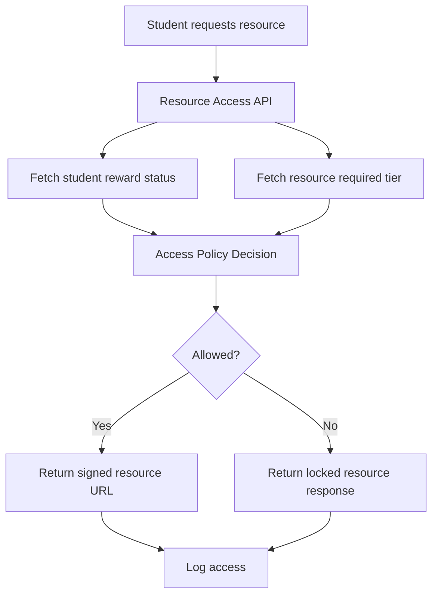

## 25.13 Scalability Strategy

The MVP can run as a modular monolith because the expected scale is small. However, the codebase should be modular enough to separate services later.

### MVP Scaling Strategy

- Single FastAPI backend.
- PostgreSQL database.
- Optional Redis for QR token cache.
- Object storage for resources.
- Frontend hosted as static/PWA deployment.

### Future Scaling Strategy

- Separate attendance service.
- Separate quiz service.
- Separate analytics service.
- Background workers for analytics rollups.
- Queue-based AI processing.
- Read replicas for reporting.

## 25.14 Reliability Strategy

- Prevent duplicate attendance by unique constraint on `(session_id, student_id)`.
- Expire QR tokens quickly.
- Store attendance decisions with verification status.
- Allow manual review for network/location edge cases.
- Maintain audit logs for overrides.
- Use database transactions for attendance creation.

## 25.15 Observability Strategy

Track:

- API latency.
- Check-in success rate.
- QR expiry rejection rate.
- Pending review count.
- Quiz submission rate.
- Database errors.
- Login bursts.
- Resource access failures.
- AI processing completion/failure rate.

## 25.16 HLD Security Boundaries

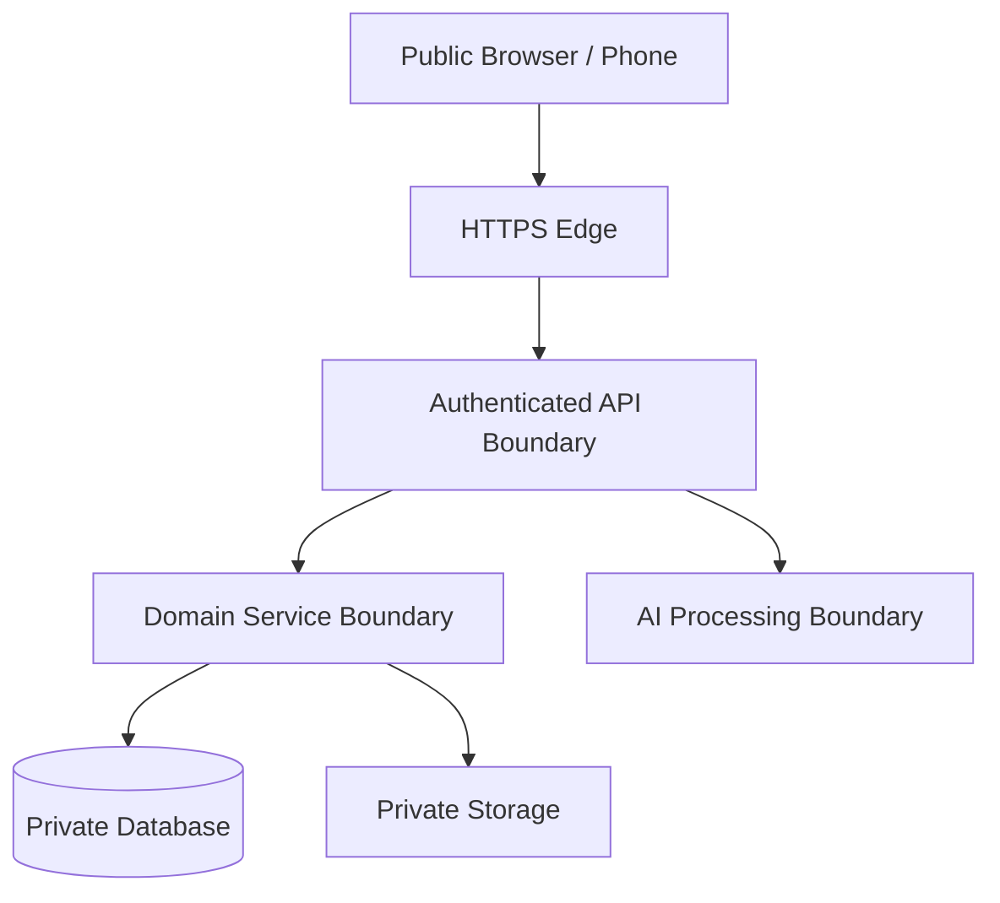

## 25.17 HLD Deployment View

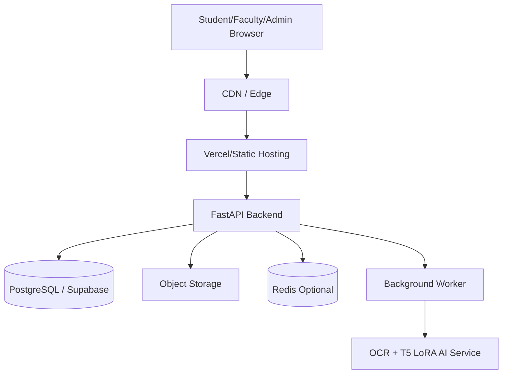

---

# 26. Complete Low-Level Design LLD Document

## 26.1 LLD Purpose

The Low-Level Design defines the internal modules, classes, functions, database constraints, validation rules, and service-level behavior required to implement AttendIQ COA.

## 26.2 Backend Module Design

```text
backend/app/
├── auth/
│   ├── routes.py
│   ├── service.py
│   ├── schemas.py
│   └── dependencies.py
├── users/
│   ├── routes.py
│   ├── service.py
│   ├── repository.py
│   └── schemas.py
├── sessions/
│   ├── routes.py
│   ├── service.py
│   ├── repository.py
│   └── schemas.py
├── attendance/
│   ├── routes.py
│   ├── service.py
│   ├── repository.py
│   ├── policy.py
│   └── schemas.py
├── verification/
│   ├── qr_service.py
│   ├── device_validator.py
│   ├── proximity_validator.py
│   └── risk_engine.py
├── quizzes/
│   ├── routes.py
│   ├── service.py
│   ├── repository.py
│   └── scoring.py
├── rewards/
│   ├── service.py
│   ├── repository.py
│   └── tier_engine.py
├── resources/
│   ├── routes.py
│   ├── service.py
│   ├── repository.py
│   └── access_policy.py
├── analytics/
│   ├── routes.py
│   ├── service.py
│   └── aggregations.py
├── audits/
│   ├── service.py
│   └── repository.py
└── ai/
    ├── routes.py
    ├── service.py
    ├── ocr_client.py
    ├── model_client.py
    └── recommendation_service.py
```

## 26.3 Core Service Classes

### AuthService

Responsibilities:

- Register user.
- Authenticate credentials.
- Create access token.
- Refresh token.
- Revoke session.
- Validate role.

Pseudo-interface:

```python
class AuthService:
    def register_user(payload: RegisterRequest) -> UserResponse: ...
    def login(payload: LoginRequest) -> TokenResponse: ...
    def logout(user_id: UUID, device_hash: str) -> None: ...
    def verify_token(token: str) -> AuthContext: ...
```

### SessionService

Responsibilities:

- Create class session.
- Start class session.
- Close class session.
- Fetch live session metrics.

```python
class SessionService:
    def create_session(payload: CreateSessionRequest, faculty_id: UUID) -> SessionResponse: ...
    def start_session(session_id: UUID, config: StartSessionRequest) -> SessionStatusResponse: ...
    def close_session(session_id: UUID, remarks: str) -> SessionStatusResponse: ...
    def get_live_status(session_id: UUID) -> LiveSessionResponse: ...
```

### QRTokenService

Responsibilities:

- Generate signed QR token.
- Hash token before storage.
- Validate token signature and expiry.
- Revoke expired tokens.

```python
class QRTokenService:
    def generate_token(session_id: UUID, ttl_seconds: int) -> QRTokenResponse: ...
    def validate_token(session_id: UUID, qr_payload: str) -> QRValidationResult: ...
```

### VerificationEngine

Responsibilities:

- Execute attendance verification pipeline.
- Compute risk score.
- Return verified/pending/rejected decision.

```python
class VerificationEngine:
    def verify_check_in(payload: CheckInRequest, user_id: UUID) -> VerificationDecision: ...
```

Decision logic:

```text
IF session is not active -> reject
IF student is not enrolled -> reject
IF QR token invalid or expired -> reject
IF duplicate attendance exists -> reject
IF device risk high -> pending_review
IF optional proximity fails -> pending_review or risk flag
ELSE -> verified
```

### AttendanceService

Responsibilities:

- Accept check-in request.
- Call verification engine.
- Create attendance record.
- Return status response.

```python
class AttendanceService:
    def check_in(payload: CheckInRequest, student_id: UUID) -> AttendanceResponse: ...
    def get_student_summary(student_id: UUID, course_id: UUID) -> AttendanceSummary: ...
    def override_attendance(attendance_id: UUID, payload: OverrideRequest, actor_id: UUID) -> AttendanceResponse: ...
```

### QuizService

Responsibilities:

- Create question.
- Launch quiz.
- Fetch active quiz.
- Submit response.
- Compute score.

```python
class QuizService:
    def create_question(payload: QuestionRequest, faculty_id: UUID) -> QuestionResponse: ...
    def launch_quiz(session_id: UUID, payload: LaunchQuizRequest) -> SessionQuizResponse: ...
    def get_active_quiz(session_id: UUID, student_id: UUID) -> ActiveQuizResponse: ...
    def submit_response(session_quiz_id: UUID, payload: SubmitQuizRequest, student_id: UUID) -> QuizResponse: ...
```

### RewardService

Responsibilities:

- Recalculate reward status.
- Determine current tier.
- Determine next tier.
- Update resource access eligibility.

```python
class RewardService:
    def recalculate_student_course_status(student_id: UUID, course_id: UUID) -> RewardStatus: ...
    def get_reward_status(student_id: UUID, course_id: UUID) -> RewardStatus: ...
```

### ResourceService

Responsibilities:

- Upload/register resource.
- Check tier access.
- Return signed URL if allowed.
- Log access attempt.

```python
class ResourceService:
    def create_resource(payload: ResourceRequest, faculty_id: UUID) -> ResourceResponse: ...
    def list_student_resources(student_id: UUID, course_id: UUID) -> ResourceListResponse: ...
    def get_resource_access(student_id: UUID, resource_id: UUID) -> ResourceAccessResponse: ...
```

### AIService Phase 2

Responsibilities:

- Accept AI submission.
- Store uploaded image metadata.
- Trigger OCR.
- Run T5 LoRA inference.
- Map recommendations.
- Store feedback.

```python
class AIService:
    def create_submission(payload: AISubmissionRequest, student_id: UUID) -> AISubmissionResponse: ...
    def process_submission(submission_id: UUID) -> AIFeedbackResult: ...
    def get_submission(submission_id: UUID, student_id: UUID) -> AISubmissionDetail: ...
```

## 26.4 Validation Rules

### Attendance Check-In Validation

| Rule | Behavior |
|---|---|
| Session must be active | Else reject. |
| Student must be enrolled | Else reject. |
| QR must be valid | Else reject. |
| QR must not be expired | Else reject. |
| Student must not already have attendance for same session | Else reject duplicate. |
| Device hash must be present | Else pending review or reject depending policy. |
| Proximity signal optional in MVP | If missing, mark risk flag only. |

### Quiz Submission Validation

| Rule | Behavior |
|---|---|
| Session quiz must be active | Else reject. |
| Current time must be before closes_at | Else reject. |
| Student must be enrolled in session section | Else reject. |
| Duplicate response should not be allowed | Else reject duplicate. |

### Resource Access Validation

| Rule | Behavior |
|---|---|
| Student must be enrolled in course | Else deny. |
| Resource must be active | Else deny. |
| Student tier must meet required tier | Else deny. |
| Access attempt must be logged | Always log. |

## 26.5 Database Constraints

Recommended constraints:

```text
users.email UNIQUE
users.institutional_id UNIQUE
courses.course_code UNIQUE
classrooms.room_code UNIQUE
attendance_records(session_id, student_id) UNIQUE
quiz_responses(session_quiz_id, student_id) UNIQUE
device_sessions(user_id, device_hash, is_active) indexed
resources(course_id, required_tier) indexed
```

## 26.6 Error Response Standard

```json
{
  "success": false,
  "message": "Human readable error message",
  "error": {
    "code": "ERROR_CODE",
    "details": "Detailed explanation"
  }
}
```

Common error codes:

```text
AUTH_INVALID_CREDENTIALS
AUTH_TOKEN_EXPIRED
FORBIDDEN_ROLE
SESSION_NOT_ACTIVE
QR_EXPIRED
QR_INVALID
STUDENT_NOT_ENROLLED
ATTENDANCE_DUPLICATE
QUIZ_CLOSED
RESOURCE_LOCKED
AI_PROCESSING_FAILED
```

## 26.7 Background Jobs

| Job | Purpose |
|---|---|
| expire_qr_tokens | Revoke stale QR tokens. |
| recalculate_rewards | Update reward tier after attendance/quiz changes. |
| aggregate_analytics | Build course/session analytics. |
| process_ai_submission | Run OCR and T5 LoRA inference. |
| cleanup_old_logs | Apply retention policy. |

---

# 27. Swagger / OpenAPI Specification

```yaml
openapi: 3.0.3
info:
  title: AttendIQ COA API
  version: 1.0.0
  description: API specification for smart attendance, engagement, rewards, resources, analytics, and Phase 2 AI learning assistant.
servers:
  - url: https://api.attendiq.example.com/api/v1
    description: Production API
  - url: http://localhost:8000/api/v1
    description: Local development API

tags:
  - name: Auth
  - name: Courses
  - name: Sessions
  - name: Attendance
  - name: Quizzes
  - name: Resources
  - name: Rewards
  - name: Analytics
  - name: AI

paths:
  /auth/register:
    post:
      tags: [Auth]
      summary: Register user
      requestBody:
        required: true
        content:
          application/json:
            schema:
              $ref: '#/components/schemas/RegisterRequest'
      responses:
        '200':
          description: User registered
          content:
            application/json:
              schema:
                $ref: '#/components/schemas/UserCreatedResponse'

  /auth/login:
    post:
      tags: [Auth]
      summary: Login user
      requestBody:
        required: true
        content:
          application/json:
            schema:
              $ref: '#/components/schemas/LoginRequest'
      responses:
        '200':
          description: Login successful
          content:
            application/json:
              schema:
                $ref: '#/components/schemas/LoginResponse'

  /courses:
    get:
      tags: [Courses]
      summary: List courses visible to current user
      security:
        - bearerAuth: []
      responses:
        '200':
          description: List of courses

  /faculty/sessions:
    post:
      tags: [Sessions]
      summary: Create class session
      security:
        - bearerAuth: []
      requestBody:
        required: true
        content:
          application/json:
            schema:
              $ref: '#/components/schemas/CreateSessionRequest'
      responses:
        '200':
          description: Session created

  /faculty/sessions/{sessionId}/start:
    post:
      tags: [Sessions]
      summary: Start class session
      security:
        - bearerAuth: []
      parameters:
        - in: path
          name: sessionId
          required: true
          schema:
            type: string
            format: uuid
      requestBody:
        required: true
        content:
          application/json:
            schema:
              $ref: '#/components/schemas/StartSessionRequest'
      responses:
        '200':
          description: Session started

  /faculty/sessions/{sessionId}/qr:
    get:
      tags: [Sessions]
      summary: Get current QR payload
      security:
        - bearerAuth: []
      parameters:
        - in: path
          name: sessionId
          required: true
          schema:
            type: string
            format: uuid
      responses:
        '200':
          description: QR payload returned

  /student/attendance/check-in:
    post:
      tags: [Attendance]
      summary: Student attendance check-in
      security:
        - bearerAuth: []
      requestBody:
        required: true
        content:
          application/json:
            schema:
              $ref: '#/components/schemas/CheckInRequest'
      responses:
        '200':
          description: Attendance decision returned

  /student/attendance/summary:
    get:
      tags: [Attendance]
      summary: Get student attendance summary
      security:
        - bearerAuth: []
      parameters:
        - in: query
          name: courseId
          required: true
          schema:
            type: string
            format: uuid
      responses:
        '200':
          description: Attendance summary returned

  /faculty/sessions/{sessionId}/quizzes:
    post:
      tags: [Quizzes]
      summary: Launch quiz in session
      security:
        - bearerAuth: []
      parameters:
        - in: path
          name: sessionId
          required: true
          schema:
            type: string
            format: uuid
      requestBody:
        required: true
        content:
          application/json:
            schema:
              $ref: '#/components/schemas/LaunchQuizRequest'
      responses:
        '200':
          description: Quiz launched

  /student/quizzes/{sessionQuizId}/responses:
    post:
      tags: [Quizzes]
      summary: Submit quiz response
      security:
        - bearerAuth: []
      parameters:
        - in: path
          name: sessionQuizId
          required: true
          schema:
            type: string
            format: uuid
      requestBody:
        required: true
        content:
          application/json:
            schema:
              $ref: '#/components/schemas/SubmitQuizResponseRequest'
      responses:
        '200':
          description: Quiz response submitted

  /student/resources:
    get:
      tags: [Resources]
      summary: List student resources by access tier
      security:
        - bearerAuth: []
      parameters:
        - in: query
          name: courseId
          required: true
          schema:
            type: string
            format: uuid
      responses:
        '200':
          description: Resources returned

  /student/rewards:
    get:
      tags: [Rewards]
      summary: Get reward status
      security:
        - bearerAuth: []
      parameters:
        - in: query
          name: courseId
          required: true
          schema:
            type: string
            format: uuid
      responses:
        '200':
          description: Reward status returned

  /faculty/analytics/course/{courseId}:
    get:
      tags: [Analytics]
      summary: Get course analytics
      security:
        - bearerAuth: []
      parameters:
        - in: path
          name: courseId
          required: true
          schema:
            type: string
            format: uuid
      responses:
        '200':
          description: Course analytics returned

  /student/ai/submissions:
    post:
      tags: [AI]
      summary: Create AI notebook/answer submission
      security:
        - bearerAuth: []
      requestBody:
        required: true
        content:
          application/json:
            schema:
              $ref: '#/components/schemas/AISubmissionRequest'
      responses:
        '200':
          description: AI submission queued

components:
  securitySchemes:
    bearerAuth:
      type: http
      scheme: bearer
      bearerFormat: JWT

  schemas:
    RegisterRequest:
      type: object
      required: [institutionalId, fullName, email, password, role]
      properties:
        institutionalId:
          type: string
        fullName:
          type: string
        email:
          type: string
          format: email
        password:
          type: string
        role:
          type: string
          enum: [student, faculty, admin]

    LoginRequest:
      type: object
      required: [email, password, deviceHash]
      properties:
        email:
          type: string
          format: email
        password:
          type: string
        deviceHash:
          type: string

    LoginResponse:
      type: object
      properties:
        success:
          type: boolean
        message:
          type: string
        data:
          type: object
          properties:
            accessToken:
              type: string
            refreshToken:
              type: string
            expiresIn:
              type: integer

    UserCreatedResponse:
      type: object
      properties:
        success:
          type: boolean
        message:
          type: string

    CreateSessionRequest:
      type: object
      required: [sectionId, classroomId, topicTitle, sessionDate, startTime]
      properties:
        sectionId:
          type: string
          format: uuid
        classroomId:
          type: string
          format: uuid
        topicTitle:
          type: string
        sessionDate:
          type: string
          format: date
        startTime:
          type: string
          format: date-time
        endTime:
          type: string
          format: date-time

    StartSessionRequest:
      type: object
      properties:
        qrRotationSeconds:
          type: integer
          example: 30
        allowProximitySignal:
          type: boolean
          example: true

    CheckInRequest:
      type: object
      required: [sessionId, qrPayload, deviceHash]
      properties:
        sessionId:
          type: string
          format: uuid
        qrPayload:
          type: string
        deviceHash:
          type: string
        proximitySignal:
          type: object
          properties:
            wifiSsidHash:
              type: string
            beaconHash:
              type: string

    LaunchQuizRequest:
      type: object
      required: [questionId, durationSeconds]
      properties:
        questionId:
          type: string
          format: uuid
        durationSeconds:
          type: integer

    SubmitQuizResponseRequest:
      type: object
      properties:
        selectedOption:
          type: string
        freeTextAnswer:
          type: string

    AISubmissionRequest:
      type: object
      required: [courseId, imageFileUrl]
      properties:
        courseId:
          type: string
          format: uuid
        sessionId:
          type: string
          format: uuid
        imageFileUrl:
          type: string
```

---

# 28. PostgreSQL DDL Scripts

```sql
CREATE EXTENSION IF NOT EXISTS "uuid-ossp";

CREATE TABLE departments (
    id UUID PRIMARY KEY DEFAULT uuid_generate_v4(),
    name VARCHAR(150) NOT NULL,
    code VARCHAR(20) UNIQUE,
    created_at TIMESTAMP DEFAULT NOW()
);

CREATE TABLE users (
    id UUID PRIMARY KEY DEFAULT uuid_generate_v4(),
    institutional_id VARCHAR(50) UNIQUE NOT NULL,
    full_name VARCHAR(150) NOT NULL,
    email VARCHAR(150) UNIQUE NOT NULL,
    password_hash TEXT,
    role VARCHAR(20) NOT NULL CHECK (role IN ('student', 'faculty', 'admin')),
    phone_hash VARCHAR(255),
    is_active BOOLEAN DEFAULT TRUE,
    created_at TIMESTAMP DEFAULT NOW(),
    updated_at TIMESTAMP DEFAULT NOW()
);

CREATE TABLE courses (
    id UUID PRIMARY KEY DEFAULT uuid_generate_v4(),
    department_id UUID REFERENCES departments(id) ON DELETE SET NULL,
    course_code VARCHAR(30) UNIQUE NOT NULL,
    course_name VARCHAR(150) NOT NULL,
    syllabus_summary TEXT,
    created_at TIMESTAMP DEFAULT NOW()
);

CREATE TABLE course_sections (
    id UUID PRIMARY KEY DEFAULT uuid_generate_v4(),
    course_id UUID NOT NULL REFERENCES courses(id) ON DELETE CASCADE,
    faculty_id UUID NOT NULL REFERENCES users(id) ON DELETE RESTRICT,
    section_name VARCHAR(100) NOT NULL,
    academic_term VARCHAR(50) NOT NULL,
    created_at TIMESTAMP DEFAULT NOW()
);

CREATE TABLE enrollments (
    id UUID PRIMARY KEY DEFAULT uuid_generate_v4(),
    student_id UUID NOT NULL REFERENCES users(id) ON DELETE CASCADE,
    section_id UUID NOT NULL REFERENCES course_sections(id) ON DELETE CASCADE,
    enrollment_status VARCHAR(30) DEFAULT 'active',
    created_at TIMESTAMP DEFAULT NOW(),
    UNIQUE(student_id, section_id)
);

CREATE TABLE classrooms (
    id UUID PRIMARY KEY DEFAULT uuid_generate_v4(),
    room_code VARCHAR(50) UNIQUE NOT NULL,
    room_name VARCHAR(150) NOT NULL,
    building_name VARCHAR(150),
    wifi_ssid_hash VARCHAR(255),
    beacon_id_hash VARCHAR(255),
    latitude DECIMAL(10,7),
    longitude DECIMAL(10,7),
    created_at TIMESTAMP DEFAULT NOW()
);

CREATE TABLE class_sessions (
    id UUID PRIMARY KEY DEFAULT uuid_generate_v4(),
    section_id UUID NOT NULL REFERENCES course_sections(id) ON DELETE CASCADE,
    classroom_id UUID REFERENCES classrooms(id) ON DELETE SET NULL,
    topic_title VARCHAR(200) NOT NULL,
    session_date DATE NOT NULL,
    start_time TIMESTAMP NOT NULL,
    end_time TIMESTAMP,
    status VARCHAR(30) DEFAULT 'scheduled' CHECK (status IN ('scheduled', 'active', 'paused', 'closed', 'cancelled')),
    created_by UUID REFERENCES users(id) ON DELETE SET NULL,
    created_at TIMESTAMP DEFAULT NOW()
);

CREATE TABLE qr_tokens (
    id UUID PRIMARY KEY DEFAULT uuid_generate_v4(),
    session_id UUID NOT NULL REFERENCES class_sessions(id) ON DELETE CASCADE,
    token_hash VARCHAR(255) NOT NULL,
    valid_from TIMESTAMP NOT NULL,
    valid_until TIMESTAMP NOT NULL,
    is_revoked BOOLEAN DEFAULT FALSE,
    created_at TIMESTAMP DEFAULT NOW()
);

CREATE TABLE device_sessions (
    id UUID PRIMARY KEY DEFAULT uuid_generate_v4(),
    user_id UUID NOT NULL REFERENCES users(id) ON DELETE CASCADE,
    device_hash VARCHAR(255) NOT NULL,
    login_ip_hash VARCHAR(255),
    user_agent_hash VARCHAR(255),
    session_started_at TIMESTAMP DEFAULT NOW(),
    session_expires_at TIMESTAMP NOT NULL,
    is_active BOOLEAN DEFAULT TRUE
);

CREATE TABLE attendance_records (
    id UUID PRIMARY KEY DEFAULT uuid_generate_v4(),
    session_id UUID NOT NULL REFERENCES class_sessions(id) ON DELETE CASCADE,
    student_id UUID NOT NULL REFERENCES users(id) ON DELETE CASCADE,
    enrollment_id UUID REFERENCES enrollments(id) ON DELETE SET NULL,
    check_in_time TIMESTAMP NOT NULL DEFAULT NOW(),
    verification_status VARCHAR(30) NOT NULL CHECK (verification_status IN ('verified', 'pending_review', 'rejected', 'manual_override')),
    qr_verified BOOLEAN DEFAULT FALSE,
    device_verified BOOLEAN DEFAULT FALSE,
    proximity_verified BOOLEAN DEFAULT FALSE,
    risk_score INTEGER DEFAULT 0 CHECK (risk_score >= 0 AND risk_score <= 100),
    remarks TEXT,
    created_at TIMESTAMP DEFAULT NOW(),
    UNIQUE(session_id, student_id)
);

CREATE TABLE quiz_questions (
    id UUID PRIMARY KEY DEFAULT uuid_generate_v4(),
    course_id UUID NOT NULL REFERENCES courses(id) ON DELETE CASCADE,
    topic VARCHAR(150) NOT NULL,
    question_text TEXT NOT NULL,
    option_a TEXT,
    option_b TEXT,
    option_c TEXT,
    option_d TEXT,
    correct_option VARCHAR(10),
    difficulty VARCHAR(20) DEFAULT 'medium' CHECK (difficulty IN ('easy', 'medium', 'hard')),
    created_by UUID REFERENCES users(id) ON DELETE SET NULL,
    created_at TIMESTAMP DEFAULT NOW()
);

CREATE TABLE session_quizzes (
    id UUID PRIMARY KEY DEFAULT uuid_generate_v4(),
    session_id UUID NOT NULL REFERENCES class_sessions(id) ON DELETE CASCADE,
    question_id UUID NOT NULL REFERENCES quiz_questions(id) ON DELETE CASCADE,
    launched_at TIMESTAMP NOT NULL DEFAULT NOW(),
    closes_at TIMESTAMP NOT NULL,
    status VARCHAR(30) DEFAULT 'active' CHECK (status IN ('active', 'closed', 'cancelled'))
);

CREATE TABLE quiz_responses (
    id UUID PRIMARY KEY DEFAULT uuid_generate_v4(),
    session_quiz_id UUID NOT NULL REFERENCES session_quizzes(id) ON DELETE CASCADE,
    student_id UUID NOT NULL REFERENCES users(id) ON DELETE CASCADE,
    selected_option VARCHAR(10),
    free_text_answer TEXT,
    is_correct BOOLEAN,
    response_time TIMESTAMP DEFAULT NOW(),
    UNIQUE(session_quiz_id, student_id)
);

CREATE TABLE resources (
    id UUID PRIMARY KEY DEFAULT uuid_generate_v4(),
    course_id UUID NOT NULL REFERENCES courses(id) ON DELETE CASCADE,
    uploaded_by UUID REFERENCES users(id) ON DELETE SET NULL,
    title VARCHAR(200) NOT NULL,
    resource_type VARCHAR(50) NOT NULL,
    topic VARCHAR(150),
    file_url TEXT NOT NULL,
    required_tier VARCHAR(30) DEFAULT 'bronze' CHECK (required_tier IN ('bronze', 'silver', 'gold', 'platinum')),
    is_active BOOLEAN DEFAULT TRUE,
    created_at TIMESTAMP DEFAULT NOW()
);

CREATE TABLE reward_policies (
    id UUID PRIMARY KEY DEFAULT uuid_generate_v4(),
    course_id UUID NOT NULL REFERENCES courses(id) ON DELETE CASCADE,
    tier_name VARCHAR(30) NOT NULL CHECK (tier_name IN ('bronze', 'silver', 'gold', 'platinum')),
    min_attendance_percentage DECIMAL(5,2) NOT NULL,
    min_participation_score DECIMAL(5,2) DEFAULT 0,
    created_at TIMESTAMP DEFAULT NOW(),
    UNIQUE(course_id, tier_name)
);

CREATE TABLE student_reward_status (
    id UUID PRIMARY KEY DEFAULT uuid_generate_v4(),
    student_id UUID NOT NULL REFERENCES users(id) ON DELETE CASCADE,
    course_id UUID NOT NULL REFERENCES courses(id) ON DELETE CASCADE,
    attendance_percentage DECIMAL(5,2) DEFAULT 0,
    participation_score DECIMAL(8,2) DEFAULT 0,
    current_tier VARCHAR(30) DEFAULT 'none',
    updated_at TIMESTAMP DEFAULT NOW(),
    UNIQUE(student_id, course_id)
);

CREATE TABLE resource_access_logs (
    id UUID PRIMARY KEY DEFAULT uuid_generate_v4(),
    student_id UUID NOT NULL REFERENCES users(id) ON DELETE CASCADE,
    resource_id UUID NOT NULL REFERENCES resources(id) ON DELETE CASCADE,
    access_time TIMESTAMP DEFAULT NOW(),
    access_allowed BOOLEAN NOT NULL,
    denial_reason TEXT
);

CREATE TABLE ai_submissions (
    id UUID PRIMARY KEY DEFAULT uuid_generate_v4(),
    student_id UUID NOT NULL REFERENCES users(id) ON DELETE CASCADE,
    course_id UUID NOT NULL REFERENCES courses(id) ON DELETE CASCADE,
    session_id UUID REFERENCES class_sessions(id) ON DELETE SET NULL,
    image_file_url TEXT NOT NULL,
    extracted_text TEXT,
    model_feedback JSONB,
    processing_status VARCHAR(30) DEFAULT 'queued' CHECK (processing_status IN ('queued', 'processing', 'completed', 'failed')),
    created_at TIMESTAMP DEFAULT NOW()
);

CREATE TABLE audit_logs (
    id UUID PRIMARY KEY DEFAULT uuid_generate_v4(),
    actor_user_id UUID REFERENCES users(id) ON DELETE SET NULL,
    action VARCHAR(100) NOT NULL,
    entity_type VARCHAR(100) NOT NULL,
    entity_id UUID,
    metadata JSONB,
    created_at TIMESTAMP DEFAULT NOW()
);

CREATE INDEX idx_class_sessions_section ON class_sessions(section_id);
CREATE INDEX idx_class_sessions_status ON class_sessions(status);
CREATE INDEX idx_attendance_student ON attendance_records(student_id);
CREATE INDEX idx_attendance_session ON attendance_records(session_id);
CREATE INDEX idx_quiz_responses_student ON quiz_responses(student_id);
CREATE INDEX idx_resources_course_tier ON resources(course_id, required_tier);
CREATE INDEX idx_reward_status_student_course ON student_reward_status(student_id, course_id);
CREATE INDEX idx_audit_logs_entity ON audit_logs(entity_type, entity_id);
CREATE INDEX idx_ai_submissions_status ON ai_submissions(processing_status);
```

---

# 29. Sequence Diagrams For Every Major API Flow

## 29.1 User Registration

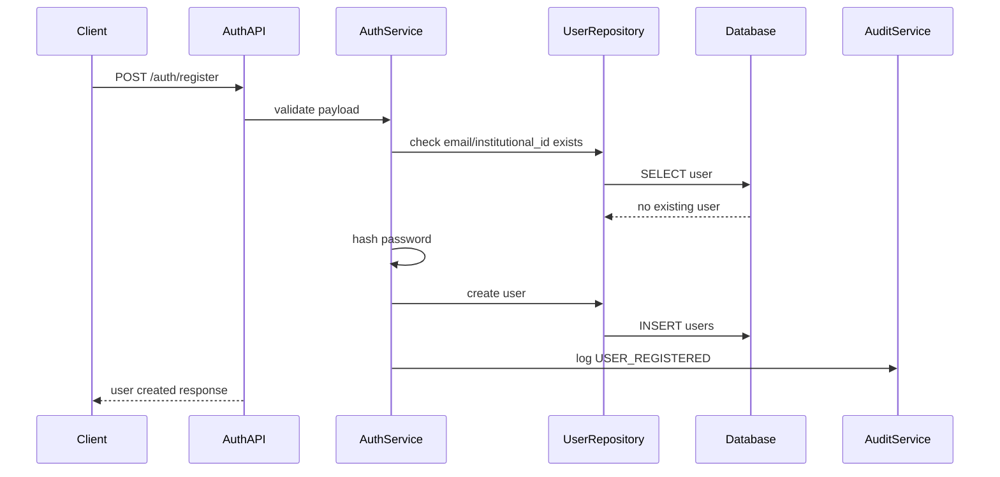

## 29.2 User Login

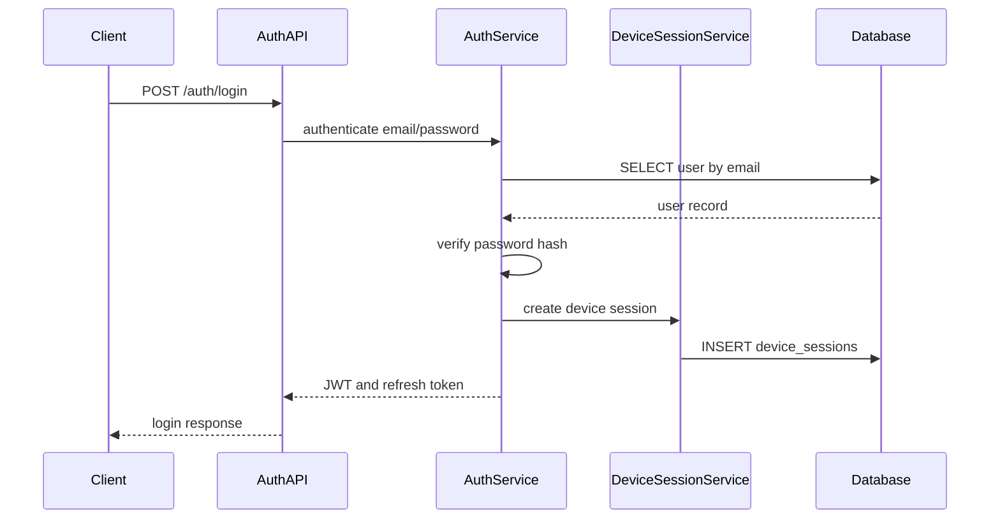

## 29.3 Create Class Session

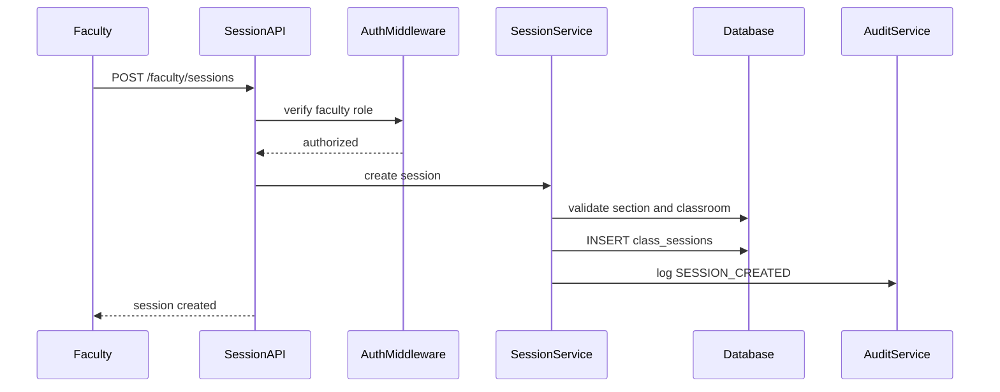

## 29.4 Start Session And Generate QR

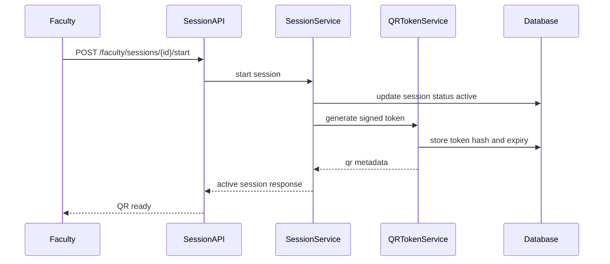

## 29.5 Get Current QR

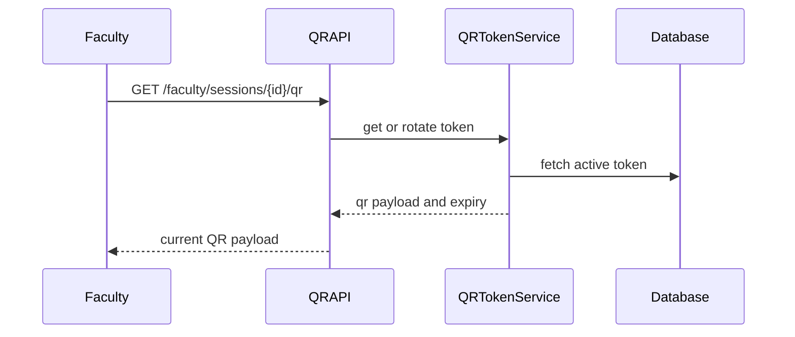

## 29.6 Student Check-In

```mermaid
sequenceDiagram
    participant Student
    participant AttendanceAPI
    participant AttendanceService
    participant VerificationEngine
    participant QRTokenService
    participant DeviceValidator
    participant Database
    participant RewardService

    Student->>AttendanceAPI: POST /student/attendance/check-in
    AttendanceAPI->>AttendanceService: check_in request
    AttendanceService->>VerificationEngine: verify request
    VerificationEngine->>QRTokenService: validate QR
    VerificationEngine->>DeviceValidator: validate device session
    VerificationEngine->>Database: check session/enrollment/duplicate
    Database-->>VerificationEngine: validation data
    VerificationEngine-->>AttendanceService: decision
    AttendanceService->>Database: INSERT attendance_records
    AttendanceService->>RewardService: recalculate reward status
    AttendanceAPI-->>Student: verified/pending/rejected response
```

## 29.7 Attendance Summary

```mermaid
sequenceDiagram
    participant Student
    participant AttendanceAPI
    participant AttendanceService
    participant Database

    Student->>AttendanceAPI: GET /student/attendance/summary
    AttendanceAPI->>AttendanceService: get summary
    AttendanceService->>Database: count total sessions and attendance
    Database-->>AttendanceService: attendance data
    AttendanceService-->>AttendanceAPI: percentage and tier
    AttendanceAPI-->>Student: attendance summary
```

## 29.8 Manual Attendance Override

```mermaid
sequenceDiagram
    participant Faculty
    participant AttendanceAPI
    participant AttendanceService
    participant Database
    participant AuditService
    participant RewardService

    Faculty->>AttendanceAPI: POST /faculty/attendance/{id}/override
    AttendanceAPI->>AttendanceService: override with remarks
    AttendanceService->>Database: update attendance record
    AttendanceService->>AuditService: log ATTENDANCE_OVERRIDE
    AttendanceService->>RewardService: recalculate reward status
    AttendanceAPI-->>Faculty: override response
```

## 29.9 Launch Quiz

```mermaid
sequenceDiagram
    participant Faculty
    participant QuizAPI
    participant QuizService
    participant Database
    participant AuditService

    Faculty->>QuizAPI: POST /faculty/sessions/{id}/quizzes
    QuizAPI->>QuizService: launch quiz
    QuizService->>Database: validate active session and question
    QuizService->>Database: INSERT session_quizzes
    QuizService->>AuditService: log QUIZ_LAUNCHED
    QuizAPI-->>Faculty: quiz launched
```

## 29.10 Fetch Active Quiz

```mermaid
sequenceDiagram
    participant Student
    participant QuizAPI
    participant QuizService
    participant Database

    Student->>QuizAPI: GET /student/sessions/{id}/active-quiz
    QuizAPI->>QuizService: get active quiz
    QuizService->>Database: fetch active session quiz
    Database-->>QuizService: quiz question and options
    QuizAPI-->>Student: active quiz payload
```

## 29.11 Submit Quiz Response

```mermaid
sequenceDiagram
    participant Student
    participant QuizAPI
    participant QuizService
    participant Database
    participant RewardService

    Student->>QuizAPI: POST /student/quizzes/{id}/responses
    QuizAPI->>QuizService: submit response
    QuizService->>Database: validate open quiz and no duplicate
    QuizService->>QuizService: evaluate correctness
    QuizService->>Database: INSERT quiz_responses
    QuizService->>RewardService: update participation score
    QuizAPI-->>Student: response submitted
```

## 29.12 Upload Resource

```mermaid
sequenceDiagram
    participant Faculty
    participant ResourceAPI
    participant ResourceService
    participant Storage
    participant Database
    participant AuditService

    Faculty->>ResourceAPI: POST /faculty/resources
    ResourceAPI->>ResourceService: create resource
    ResourceService->>Storage: verify uploaded file reference
    ResourceService->>Database: INSERT resources
    ResourceService->>AuditService: log RESOURCE_CREATED
    ResourceAPI-->>Faculty: resource created
```

## 29.13 List Student Resources

```mermaid
sequenceDiagram
    participant Student
    participant ResourceAPI
    participant ResourceService
    participant RewardService
    participant Database

    Student->>ResourceAPI: GET /student/resources
    ResourceAPI->>ResourceService: list resources
    ResourceService->>RewardService: get current tier
    ResourceService->>Database: fetch course resources
    ResourceService->>ResourceService: evaluate access per resource
    ResourceAPI-->>Student: resource list with locked/unlocked state
```

## 29.14 Course Analytics

```mermaid
sequenceDiagram
    participant Faculty
    participant AnalyticsAPI
    participant AnalyticsService
    participant Database

    Faculty->>AnalyticsAPI: GET /faculty/analytics/course/{id}
    AnalyticsAPI->>AnalyticsService: build course analytics
    AnalyticsService->>Database: aggregate attendance
    AnalyticsService->>Database: aggregate quiz performance
    AnalyticsService->>Database: aggregate resource usage
    AnalyticsService-->>AnalyticsAPI: analytics response
    AnalyticsAPI-->>Faculty: dashboard metrics
```

## 29.15 AI Submission

```mermaid
sequenceDiagram
    participant Student
    participant AIAPI
    participant AIService
    participant Storage
    participant Database
    participant Queue

    Student->>Storage: upload handwritten image
    Storage-->>Student: image file URL
    Student->>AIAPI: POST /student/ai/submissions
    AIAPI->>AIService: create submission
    AIService->>Database: INSERT ai_submissions queued
    AIService->>Queue: enqueue processing job
    AIAPI-->>Student: submission queued
```

## 29.16 AI Processing

```mermaid
sequenceDiagram
    participant Worker
    participant Database
    participant OCR
    participant T5LoRA
    participant RecommendationEngine
    participant Storage

    Worker->>Database: fetch queued ai_submission
    Worker->>Storage: load image
    Worker->>OCR: extract text
    OCR-->>Worker: extracted text
    Worker->>T5LoRA: analyze concept coverage
    T5LoRA-->>Worker: feedback JSON
    Worker->>RecommendationEngine: map missing concepts to resources
    RecommendationEngine-->>Worker: recommendations
    Worker->>Database: update ai_submissions completed
```

---

# 30. AI Architecture Document: OCR + LoRA + T5 Pipeline

## 30.1 AI Objective

The AI module is a Phase 2 enhancement for personalized COA learning support. It should help students understand missing concepts in handwritten answers or notes and recommend relevant resources.

The AI system should not be used as the final grading authority. Faculty remains responsible for academic evaluation.

## 30.2 AI Use Cases

| Use Case | Description |
|---|---|
| Handwritten Answer Feedback | Student uploads answer image and receives concept coverage feedback. |
| Notes Understanding | Student uploads class notes and receives detected topics. |
| Weak Concept Identification | System identifies missing COA concepts. |
| Resource Recommendation | System recommends notes, quizzes, or revision resources. |
| Faculty Insight | Aggregated weak-topic analytics are shown to faculty. |

## 30.3 AI System Architecture

```mermaid
flowchart TD
    A[Student Uploads Image] --> B[Image Preprocessing]
    B --> C[OCR Engine]
    C --> D[Text Cleanup]
    D --> E[COA Concept Extractor]
    E --> F[T5 LoRA Feedback Model]
    F --> G[Concept Coverage Scoring]
    G --> H[Missing Concept Detector]
    H --> I[Recommendation Engine]
    I --> J[Student Feedback JSON]
    J --> K[Faculty Weak Topic Analytics]
```

## 30.4 AI Pipeline Stages

### Stage 1 Image Upload

Input:

```json
{
  "studentId": "uuid",
  "courseId": "uuid",
  "sessionId": "uuid",
  "imageFileUrl": "storage://ai-submissions/file.png"
}
```

Validation:

- File must be image/PDF format allowed by policy.
- File size must be below configured limit.
- Student must be enrolled in the course.
- File must be scanned for malicious payloads where infrastructure supports it.

### Stage 2 Image Preprocessing

Operations:

- Resize image.
- Convert to grayscale.
- Deskew image.
- Remove noise.
- Improve contrast.
- Segment text regions if needed.

### Stage 3 OCR

Possible OCR engines:

- Tesseract OCR for low-cost baseline.
- PaddleOCR for stronger multilingual and layout-aware OCR.

Output:

```json
{
  "extractedText": "Pipeline hazard occurs when...",
  "ocrConfidence": 0.86,
  "detectedBlocks": []
}
```

### Stage 4 Text Normalization

Operations:

- Remove OCR artifacts.
- Normalize COA terminology.
- Correct common OCR mistakes.
- Split into concept-level chunks.
- Preserve mathematical and architecture terms where possible.

### Stage 5 Concept Extraction

The concept extractor maps text to COA syllabus concepts:

```text
CPU blocks
Instruction cycle
Registers
Addressing modes
RTL interpretation
Signed number representation
Floating point representation
Ripple carry adder
Carry look-ahead adder
Booth multiplier
Restoring division
Non-restoring division
Hardwired control
Microprogrammed control
Semiconductor memory
I/O transfer
DMA
Interrupts
Pipeline hazards
Cache mapping
Replacement policies
Write policies
```

### Stage 6 T5 LoRA Feedback Generation

Input prompt example:

```text
You are a COA teaching assistant. Analyze the student's answer.
Topic: Pipeline Hazards
Expected concepts: structural hazard, data hazard, control hazard, forwarding, stalls, branch prediction.
Student answer: <OCR_TEXT>
Return concept coverage, missing concepts, misconception risk, and recommended resource tags.
```

Expected output:

```json
{
  "conceptCoverageScore": 82,
  "coveredConcepts": ["data hazard", "control hazard", "forwarding"],
  "missingConcepts": ["pipeline stall", "branch prediction"],
  "misconceptionRisk": "medium",
  "feedback": "Your answer covers the main idea of data hazards but should also explain stalls and branch behavior.",
  "resourceTags": ["pipeline-hazards", "branch-prediction"]
}
```

## 30.5 LoRA Fine-Tuning Dataset Design

### Training Data Sources

Use institution-approved and copyright-compliant content only, such as:

- Faculty-created notes.
- Faculty-created quizzes.
- Approved lecture summaries.
- Original student answer examples with consent/anonymization.
- Publicly licensed educational material.

### Dataset Format

```json
{
  "instruction": "Evaluate this COA answer for concept coverage.",
  "input": "Student answer text here",
  "output": {
    "conceptCoverageScore": 75,
    "coveredConcepts": ["cache mapping", "direct mapped cache"],
    "missingConcepts": ["associative mapping", "replacement policy"],
    "feedback": "The answer explains direct mapping but misses associative mapping."
  }
}
```

## 30.6 Model Training Pipeline

```mermaid
flowchart TD
    A[Collect Approved COA Data] --> B[Clean and Anonymize]
    B --> C[Create Instruction Dataset]
    C --> D[Split Train Validation Test]
    D --> E[Fine-tune T5 with LoRA]
    E --> F[Evaluate Concept Extraction]
    F --> G[Human Faculty Review]
    G --> H[Export LoRA Adapter]
    H --> I[Deploy Inference Service]
```

## 30.7 AI Evaluation Metrics

| Metric | Purpose |
|---|---|
| Concept Coverage Accuracy | Measures whether the model correctly identifies covered concepts. |
| Missing Concept Precision | Measures whether suggested missing concepts are valid. |
| Feedback Usefulness Score | Faculty/student rating of feedback quality. |
| OCR Character Error Rate | Measures OCR extraction quality. |
| Recommendation Relevance | Measures whether recommended resources fit the missing concepts. |
| Latency | Measures response time for AI feedback. |

## 30.8 AI Privacy Controls

- Store only required uploaded files.
- Allow deletion of AI submissions based on policy.
- Avoid using identifiable student names in training data.
- Use anonymized examples for fine-tuning.
- Do not use student submissions for training unless consent and policy allow it.
- Provide faculty review path for any AI-generated insights.

## 30.9 AI Failure Modes

| Failure Mode | Mitigation |
|---|---|
| OCR extracts wrong text | Show extracted text to student for review. |
| Model gives incorrect feedback | Label feedback as AI-assisted and allow faculty override. |
| AI over-penalizes short answer | Do not use AI score as official grade. |
| Hallucinated recommendation | Restrict recommendations to existing resource tags. |
| Poor handwriting | Return low OCR confidence and request clearer upload. |

## 30.10 AI Deployment Options

### Option A Local Server

- Good for college lab deployment.
- Lower recurring cost.
- Requires maintained machine.

### Option B Cloud Worker

- Easier to deploy.
- Scales better.
- May cost more if inference load grows.

### Option C Edge Device

- Privacy-friendly.
- Useful for offline or low-connectivity environments.
- Hardware availability must be considered.

---

# 31. Additional Engineering Deliverables Included In This README

This updated README now includes:

- Complete project overview.
- HLD document.
- LLD document.
- Database schema tables.
- ER diagram.
- PostgreSQL DDL scripts.
- API request and response examples.
- Swagger/OpenAPI specification.
- Sequence diagrams for all major API flows.
- UML use case diagrams.
- UML class diagrams.
- Security and privacy model.
- Threat model.
- Capacity planning.
- Deployment architecture.
- AI architecture for OCR + LoRA + T5.
- SRS document.
- Production-grade repository structure.

---

# 32. Final Architecture Positioning

AttendIQ COA is architected as a modular, privacy-first academic engagement platform. The MVP can be implemented as a clean modular monolith using FastAPI, PostgreSQL, a PWA frontend, and object storage. The design intentionally avoids expensive infrastructure and invasive surveillance. The future AI layer can be introduced as an isolated service so that OCR, LoRA fine-tuning, and T5 inference can evolve independently without destabilizing the core attendance system.

The strongest architectural decision is to keep attendance verification, learning engagement, resource unlocking, analytics, and AI feedback as connected but separable modules. This allows the platform to start small, prove value in one COA class, and later expand into a broader academic engagement system.
